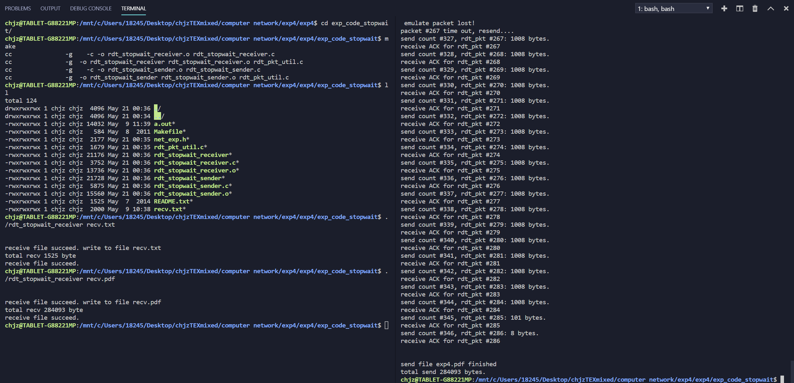
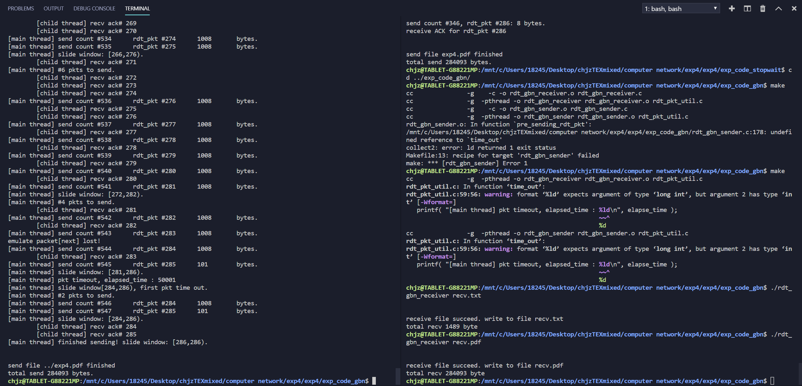

# 停-等协议
```cpp
    ///TODO
    while (1) //接收RDT数据包，直到所有数据全部接收完毕
    {
        /*
            step 1. 接收RDT数据包 :  recvfrom()
            step 2. 解封装RDT数据包 : unpack_rdt_pkt()
            step 3. 检查此数据包是否为期待的数据包 : seq_num==exp_seq_num
            step 4. 封装一个新的RDT数据包(ACK包) : pack_rdt_pkt()
            step 5. 调用不可靠数据传输发送新的RDT数据包(ACK包): udt_sendto()
        */
        pkt_len = recvfrom(sock_fd, rdt_pkt, RDT_PKT_LEN, 0, (struct sockaddr *) &client_addr,&sin_len);
        int data_len=unpack_rdt_pkt(rdt_data, rdt_pkt, pkt_len, &seq_num, &flag);
        if (flag == RDT_CTRL_END) {
            reply_pkt_len=pack_rdt_pkt(NULL,reply_pkt_buf,0,seq_num,RDT_CTRL_ACK);
            sendto(sock_fd,reply_pkt_buf,reply_pkt_len,0,(struct sockaddr*)&client_addr,sin_len);
            break;
        } else if (seq_num == exp_seq_num && flag == RDT_CTRL_DATA) {
            exp_seq_num += 1;
            total_recv_byte+=data_len;
            fwrite(rdt_data, sizeof(char),data_len, fp);
            reply_pkt_len=pack_rdt_pkt(NULL,reply_pkt_buf,0,seq_num,RDT_CTRL_ACK);
            sendto( sock_fd, reply_pkt_buf, reply_pkt_len, 0, (struct sockaddr*)&client_addr, sin_len );
        }
    }
```

# GBN协议
```cpp
    //TODO
    while(1) //接收RDT数据包，直到所有数据全部接收完毕
    {           
        /*
            step 1. 接收RDT数据包 :  recvfrom()
            step 2. 解封装RDT数据包 : unpack_rdt_pkt()
            step 3. 检查此数据包是否为期待的数据包 : seq_num==exp_seq_num
            step 4. 封装一个新的RDT数据包(ACK包) : pack_rdt_pkt()
            step 5. 调用不可靠数据传输发送新的RDT数据包(ACK包): udt_sendto()
        */
        pkt_len = recvfrom(sock_fd, rdt_pkt, RDT_PKT_LEN, 0, (struct sockaddr *) &client_addr,&sin_len);
        int data_len=unpack_rdt_pkt(rdt_data, rdt_pkt, pkt_len, &seq_num, &flag);
        if (flag == RDT_CTRL_END) {
            reply_pkt_len=pack_rdt_pkt(NULL,reply_pkt_buf,0,seq_num,RDT_CTRL_ACK);
            sendto(sock_fd,reply_pkt_buf,reply_pkt_len,0,(struct sockaddr*)&client_addr,sin_len);
            break;
        } else if (seq_num == exp_seq_num && flag == RDT_CTRL_DATA) {
            exp_seq_num += 1;
            total_recv_byte+=data_len;
            fwrite(rdt_data, sizeof(char),data_len, fp);
            reply_pkt_len=pack_rdt_pkt(NULL,reply_pkt_buf,0,seq_num,RDT_CTRL_ACK);
            sendto( sock_fd, reply_pkt_buf, reply_pkt_len, 0, (struct sockaddr*)&client_addr, sin_len );
        }
    }
```

# 实验结果
## 停-等协议


## GBN协议
