# 数据库大作业实验报告 PB16061024 陈进泽

# 实验内容
我选择的实验内容是基于go语言的网页图书管理系统实现。

# 实验概述
go语言是Google公司开发的静态强类型、编译型、并发型，并具有垃圾回收功能的编程语言。go语言从语法层面支持了并发性，并且自带网络编程对应的库，十分适于编写网络服务程序。

在传统的动态网页编写中，网页服务器如nginx，apache等用于实现域名的绑定以及多用户并发的支持，而将具体的业务处理交给cgi通用网关接口脚本处理；cgi脚本用来响应网页请求并将请求数据处理好后发给网页服务器。因为网页服务是高并发服务，cgi脚本与网页服务器缺一不可，否则只能响应一个用户的请求而大大降低用户体验，而go语言从语法的层面上提供了并发支持，使得后端服务程序可以直接支持高用户的接入，并且自带http编程库，避免了配置多个软件的麻烦。

本实验中我使用知名的beego网页应用框架用于搭建整个图书管理系统，数据库使用简单易用的sqlite用于存储图书与借书信息，具体的实现详见代码。实验平台使用jetbrains公司推出的goland IDE，内部集成了数据库管理功能。

# 代码使用说明
配置好go语言环境后build并运行。

# beego概述
beego使用传统的MVC框架来编写网络应用。所谓MVC即是指将软件服务分为Model模型、View用户视图以及Controller模块来实现功能的分离。其中Model负责转发请求对请求进行处理，View用于图形界面设计，Controller用于内部逻辑以及数据管理和数据库设计。

本实验代码主要分为分为`conf`，`db`，`models`，`routers`，`static`，`views`四个文件夹以及`main.go`主程序组成。

## conf
用于存储配置信息，如是否开启session等。

## db
用于存储数据库或数据库相关信息。

## models
用于存储实际会用到的数据模型，即数据库操作会用到的数据模型。

## routers
用于管理用户路由解析规则，如哪个路径对应哪个处理程序。

## static
用于存储静态的javascript脚本或css文件，图片等。

## views
用于存储html文件，作为模板在实际使用中渲染输出。

## main.go
```go
package main

import (
	_ "webDev/routers"

	"github.com/astaxie/beego"
	"github.com/astaxie/beego/orm"
	_ "github.com/mattn/go-sqlite3"
)

func init() {
	_ = orm.RegisterDataBase("default", "sqlite3", "db/book.db")
}

func main() {
	beego.Run()
}
```

仅包含以上代码，包括数据库的注册以及入口程序。

# 数据库结构
我设计的图书馆里数据库包含三个表：books_info用于存储图书信息，user_info用于存储用户信息，borrows_info用于存储借阅信息。
## books_info表
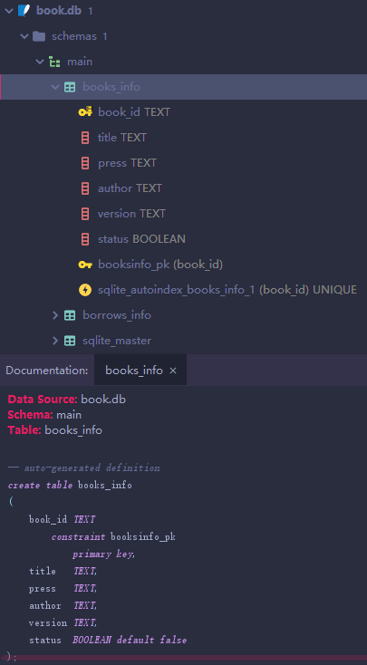

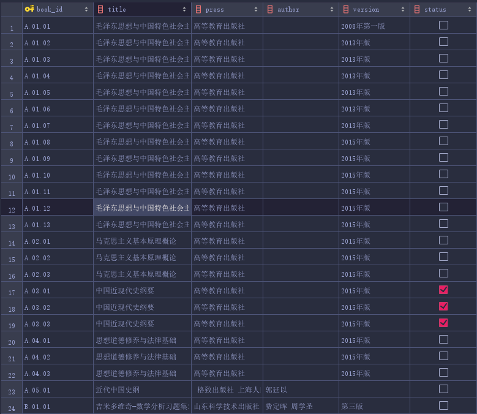

本表由已知excel文档导入形成，故有较多TEXT类表项。其中book_id为主键，形式为[class].[book].[id]，class表示书的大类，如数学书、物理书等，book表示书的编号，该编号相同的书为同一本书，id表示该书的序号，表示同一本书的不同馆藏副本，三者合一构成了书的主键。

该表中title表示书名，press表示出版社，author表示作者，version表示版本，status表示是否可借。

## user_info表
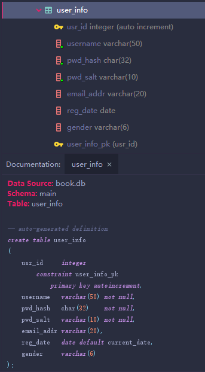

本表用于存放用户信息，如用户id，用户名，电子邮件，注册日期以及性别等信息。密码的管理为了安全性采用盐+哈希值的存储方式，盐在注册时随机产生，哈希算法为sha256。

## burrows_info
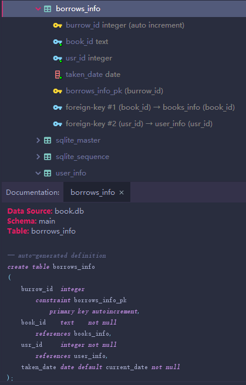

本表用于存放借书信息，包括借阅id，借出日期以及指向书本与借阅人的外键。考虑到应还日期可以由借出日期唯一得到，这里只保存借阅日期，且其默认值为建立记录的日期。

## ER图
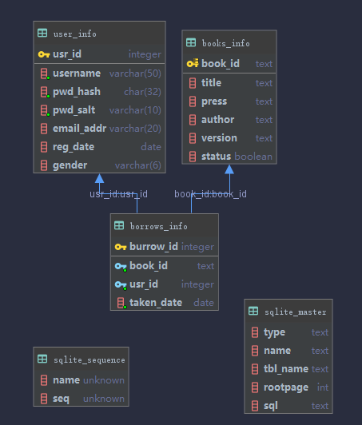

# 重要代码解释
## routers/router.go
```go
package routers

import (
	"github.com/astaxie/beego"
	"webDev/controllers"
)

func init() {
	beego.Router("/", &controllers.MainController{})
	beego.Router("/book", &controllers.BookController{})
	beego.Router("/item", &controllers.ItemController{})
	beego.Router("/update", &controllers.UpdateController{})
	beego.Router("/delete", &controllers.DeleteController{})
	beego.Router("/insert", &controllers.InsertController{})
	beego.Router("/login", &controllers.LoginController{})
	beego.Router("/register", &controllers.RegisterController{})
}
```

该代码用于注册路由信息，如当用户访问到根目录时将请求交给`MainController`处理。

本代码总共有8个目录，分别用于查询图书、查询图书借阅情况、更新图书、删除图书、插入图书、登录以及注册。

# models/query.go
```go
package models

import "github.com/astaxie/beego/orm"

// use with raw SQL
type BookList struct {
	Title   string
	Press   string
	Author  string
	Version string
}

type Register struct {
	Username string
	PwdHash  string
	PwdSalt  string
}

// use with orm methods
type BooksInfo struct {
	BookId string `orm:"column(book_id);pk"`
	BookList
	Status bool
}

type UsrInfo struct {
	UsrId int `orm:"column(usr_id);pk"`
	Register
	EmailAddr string
	RegDate   orm.DateField
	Gender    string
}

type BorrowsInfo struct {
	BorrowId  int `orm:"column(borrow_id);pk"`
	BookId    string
	UsrId     int
	TakenDate orm.DateField
}

func init() {
	// register corresponding model
	orm.RegisterModel(new(BooksInfo), new(UsrInfo), new(BorrowsInfo))
}
```

该部分用于将与数据库对应的数据结构注册到orm内，之后便可通过调用orm方法来避开原生的sql语句查询从而提高安全性。但是仍有一些查询是没有主键的，因此不能通过CRUD操作来获取表项，这时需要使用sql原生查询来达到目的。类命名与数据库的表项直接相关。

# controllers/
## book.go
```go
package controllers

import (
	"fmt"
	"github.com/astaxie/beego"
	"github.com/astaxie/beego/orm"
	"webDev/models"
)

type BookController struct {
	beego.Controller
}

func (c *BookController) Get() {
	o := orm.NewOrm()
	var books []models.BookList

	title := c.GetString("q0")

	if title != "" {
		num, err := o.Raw("select distinct title, press, author, version from books_info where title like ?", "%"+title+"%").QueryRows(&books)
		if err == nil {
			fmt.Println(num, "lines searched")
			c.Data["books"] = books
		}
	}
	c.TplName = "book.html"
}
```

本代码根据输入的书名检索数据库内是否有对应图书，并将结果传入到controller中并在模板里显示。检索图书的原则较简单，只要书名包含检索子就将其检索出来，代码里与数据库操作相关的内容是`num, err := o.Raw("select distinct title, press, author, version from books_info where title like ?", "%"+title+"%")`，为原生数据库查询。书名的输入使用get方法。

### book.html
```html
<!doctype html>
<html lang="en">
<head>
    <title>书目检索系统</title>
    <!-- Required meta tags -->
    <meta charset="utf-8">
    <meta name="viewport" content="width=device-width, initial-scale=1, shrink-to-fit=no">

    <!-- Bootstrap CSS -->
    <link rel="stylesheet" href="https://stackpath.bootstrapcdn.com/bootstrap/4.3.1/css/bootstrap.min.css"
          integrity="sha384-ggOyR0iXCbMQv3Xipma34MD+dH/1fQ784/j6cY/iJTQUOhcWr7x9JvoRxT2MZw1T" crossorigin="anonymous">
</head>
<body>

<form method="get">
    <div class="form-group">
        <label for="q0">书名</label>
        <input type="text" class="form-control" name="q0" id="q0" placeholder="请输入书名">
    </div>
</form>

<table class="table">
    <thead>
    <tr>
        <th>Title</th>
        <th>Press</th>
        <th>Author</th>
        <th>Version</th>
    </tr>
    </thead>
    <tbody>
    {{range .books}}
        <tr>
            <td scope="row"><a href="/item?title={{.Title}}&press={{.Press}}&author={{.Author}}">{{.Title}}</a></td>
            <td>{{.Press}}</td>
            <td>{{.Author}}</td>
            <td>{{.Version}}</td>
        </tr>
    {{end}}
    </tbody>
</table>
<!-- Optional JavaScript -->
<!-- jQuery first, then Popper.js, then Bootstrap JS -->
<script src="https://code.jquery.com/jquery-3.3.1.slim.min.js"
        integrity="sha384-q8i/X+965DzO0rT7abK41JStQIAqVgRVzpbzo5smXKp4YfRvH+8abtTE1Pi6jizo"
        crossorigin="anonymous"></script>
<script src="https://cdnjs.cloudflare.com/ajax/libs/popper.js/1.14.7/umd/popper.min.js"
        integrity="sha384-UO2eT0CpHqdSJQ6hJty5KVphtPhzWj9WO1clHTMGa3JDZwrnQq4sF86dIHNDz0W1"
        crossorigin="anonymous"></script>
<script src="https://stackpath.bootstrapcdn.com/bootstrap/4.3.1/js/bootstrap.min.js"
        integrity="sha384-JjSmVgyd0p3pXB1rRibZUAYoIIy6OrQ6VrjIEaFf/nJGzIxFDsf4x0xIM+B07jRM"
        crossorigin="anonymous"></script>
</body>
</html>
```

本代码使用bootstrap用于界面的设计，但整体结构较简单。语句中
```html
    {{range .books}}
        <tr>
            <td scope="row"><a href="/item?title={{.Title}}&press={{.Press}}&author={{.Author}}">{{.Title}}</a></td>
            <td>{{.Press}}</td>
            <td>{{.Author}}</td>
            <td>{{.Version}}</td>
        </tr>
    {{end}}
```
用于显示controller中检索到的书目信息。

### 页面效果
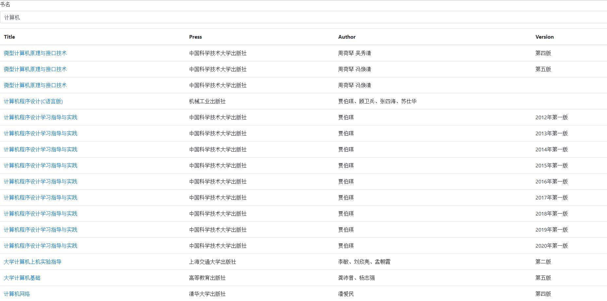

## item.go
```go
package controllers

import (
	"fmt"
	"github.com/astaxie/beego"
	"github.com/astaxie/beego/orm"
	"webDev/models"
)

type ItemController struct {
	beego.Controller
}

func (c *ItemController) Get() {
	o := orm.NewOrm()
	var books []models.BooksInfo

	title := c.GetString("title")
	press := c.GetString("press")
	author := c.GetString("author")

	num, err := o.Raw("select distinct * from books_info where title = ? and press = ? and author = ?", title, press, author).QueryRows(&books)
	if err == nil {
		fmt.Println(num, "lines affected")
		c.Data["books"] = books
	}
	c.TplName = "item.html"
}
```

本代码依旧采用原生查询，根据书名、出版商、作者唯一地决定对应的书目，并显示该书的不同馆藏信息。

### item.html
```html
<!doctype html>
<html lang="en">
<head>
    <title>Item</title>
    <!-- Required meta tags -->
    <meta charset="utf-8">
    <meta name="viewport" content="width=device-width, initial-scale=1, shrink-to-fit=no">

    <!-- Bootstrap CSS -->
    <link rel="stylesheet" href="https://stackpath.bootstrapcdn.com/bootstrap/4.3.1/css/bootstrap.min.css"
          integrity="sha384-ggOyR0iXCbMQv3Xipma34MD+dH/1fQ784/j6cY/iJTQUOhcWr7x9JvoRxT2MZw1T" crossorigin="anonymous">
</head>
<body>
<table class="table">
    <thead>
    <tr>
        <th>Id</th>
        <th>Title</th>
        <th>Press</th>
        <th>Author</th>
        <th>Version</th>
        <th>Status</th>
    </tr>
    </thead>
    <tbody>
    {{range .books}}
        <tr>
            <td scope="row">{{.BookId}}</td>
            <td>{{.Title}}</td>
            <td>{{.Press}}</td>
            <td>{{.Author}}</td>
            <td>{{.Version}}</td>
            <td>
                {{if .Status}}
                    已借出
                {{else}}
                    可借
                {{end}}
            </td>
            <td><a class="btn btn-primary" href="/update?id={{.BookId}}" role="button">修改</a>
                <a class="btn btn-primary" href="/delete?id={{.BookId}}" role="button">删除</a>
            </td>
        </tr>
    {{end}}
    </tbody>
</table>
<!-- Optional JavaScript -->
<!-- jQuery first, then Popper.js, then Bootstrap JS -->
<script src="https://code.jquery.com/jquery-3.3.1.slim.min.js"
        integrity="sha384-q8i/X+965DzO0rT7abK41JStQIAqVgRVzpbzo5smXKp4YfRvH+8abtTE1Pi6jizo"
        crossorigin="anonymous"></script>
<script src="https://cdnjs.cloudflare.com/ajax/libs/popper.js/1.14.7/umd/popper.min.js"
        integrity="sha384-UO2eT0CpHqdSJQ6hJty5KVphtPhzWj9WO1clHTMGa3JDZwrnQq4sF86dIHNDz0W1"
        crossorigin="anonymous"></script>
<script src="https://stackpath.bootstrapcdn.com/bootstrap/4.3.1/js/bootstrap.min.js"
        integrity="sha384-JjSmVgyd0p3pXB1rRibZUAYoIIy6OrQ6VrjIEaFf/nJGzIxFDsf4x0xIM+B07jRM"
        crossorigin="anonymous"></script>
</body>
</html>
```

同样`{{}}`部分用于传入controller数据，其他部分不做解释。

### 界面效果
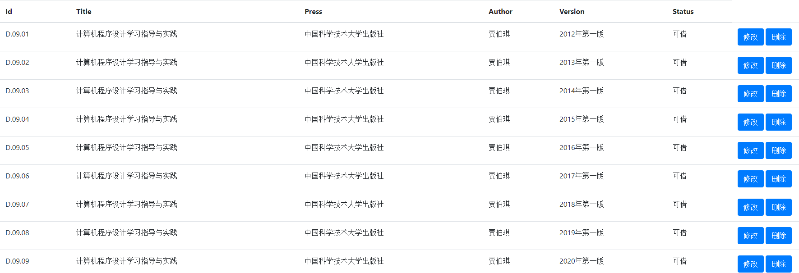

## insert.go update.go delete.go
当点入item界面的修改或删除按键后将进入对应的controller内部执行对应操作。

update.go:
```go
package controllers

import (
	"fmt"
	"github.com/astaxie/beego"
	"github.com/astaxie/beego/orm"
	"webDev/models"
)

type UpdateController struct {
	beego.Controller
}

// show information
func (c *UpdateController) Get() {
	id := c.GetString("id")
	o := orm.NewOrm()
	book := models.BooksInfo{BookId: id}

	err := o.Read(&book)
	if err != orm.ErrNoRows {
		c.Data["book"] = book
	}
	c.TplName = "update.html"
}

// update information
func (c *UpdateController) Post() {
	var book models.BooksInfo
	if err := c.ParseForm(&book); err == nil {
		o := orm.NewOrm()
		if num, err := o.Update(&book); err == nil {
			fmt.Println(num)
		}
	}
	c.Data["book"] = book
	c.TplName = "update.html"
	// TODO: handle error
}
```

delete.go:
```go
package controllers

import (
	"fmt"
	"github.com/astaxie/beego"
	"github.com/astaxie/beego/orm"
	"webDev/models"
)

type DeleteController struct {
	beego.Controller
}

func (c *DeleteController) Get() {
	// TODO: incorporate this into item page (for example : alert)
	book := models.BooksInfo{BookId:c.GetString("id")}
	o := orm.NewOrm()
	if num,err := o.Delete(&book); err== nil {
		fmt.Println(num, "row deleted successfully")
		c.Data["action"] = true
	}
	c.TplName = "delete.html"
}
```

由于在该界面时已有id信息，故采用简单的orm操作`o.Update()`与`o.Delete()`操作来实现更新与删除。代码部分不进行解释。

insert.go:
```go
package controllers

import (
	"fmt"
	"github.com/astaxie/beego"
	"github.com/astaxie/beego/orm"
	"webDev/models"
)

type InsertController struct {
	beego.Controller
}

// insert one row
func (c *InsertController) Post() {
	var book models.BooksInfo
	if err := c.ParseForm(&book); err == nil {
		o := orm.NewOrm()
		if num, err := o.Insert(&book); err == nil {
			fmt.Println(num)
		}
	}
	c.Data["book"] = book
	c.TplName = "insert.html"
	// TODO: handle error
}
```
在主页进行insert操作。

### 界面效果
update.go:
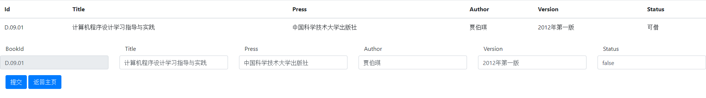

delete.go:
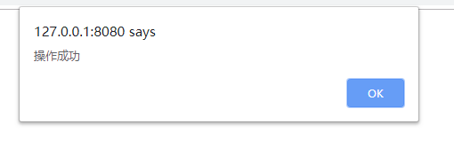

insert.go:
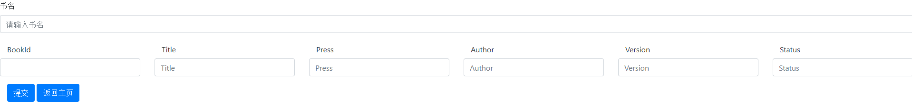

## login.go register.go
login.go:
```go
package controllers

import (
	"crypto/sha256"
	"encoding/hex"
	"github.com/astaxie/beego"
	"github.com/astaxie/beego/orm"
	"strings"
	"webDev/models"
)

type LoginController struct {
	beego.Controller
}

func (c *LoginController) Get() {
	c.TplName = "login.html"
}

func (c *LoginController) Post() {
	username := c.GetString("username")
	pwd := c.GetString("pwd")
	if pwd == "" || username == "" {
		c.Data["error"] = "must provide password and username"
	} else {
		o := orm.NewOrm()
		qs := o.QueryTable("user_info")
		qs.Filter("username", username)
		var usr models.UsrInfo
		err := qs.One(&usr)
		// TODO: handle ormErrMultiRows error
		if err == orm.ErrNoRows {
			c.Data["error"] = "user not existed"
		} else {
			s := []string{usr.PwdSalt, pwd}
			str := []byte(strings.Join(s, ""))
			hash256 := sha256.New()
			res := hex.EncodeToString(hash256.Sum(str))
			if res == usr.PwdHash {
				c.SetSession("usrId", usr.UsrId)
			} else {
				c.Data["error"] = "password not matched with username"
			}
		}
	}
	c.TplName = "login.html"
}
```

register.go:
```go
package controllers

import (
	"crypto/sha256"
	"encoding/hex"
	"github.com/Pallinder/go-randomdata"
	"github.com/astaxie/beego"
	"github.com/astaxie/beego/orm"
	"strings"
	"webDev/models"
)

type RegisterController struct {
	beego.Controller
}

func (c *RegisterController) Get() {
	c.TplName = "register.html"
}

func (c *RegisterController) Post() {
	// TODO: handle input error
	username := c.GetString("username")
	pwd := c.GetString("password")
	email := c.GetString("email")
	gender := c.GetString("gender")
	var usr models.UsrInfo
	usr.Username = username
	usr.EmailAddr = email
	usr.Gender = gender
	salt := randomdata.RandStringRunes(5)
	o := orm.NewOrm()
	qs := o.QueryTable("userInfo")
	qs.Filter("username", username)
	if err := qs.One(&usr); err == orm.ErrNoRows {
		res := []byte(strings.Join([]string{salt, pwd}, ""))
		hash256 := sha256.New()
		usr.PwdSalt = salt
		usr.PwdHash = hex.EncodeToString(hash256.Sum(res))
		id, err := o.Insert(&usr)
		if err == nil {
			c.SetSession("usrId", id)
		}
	} else {
		c.Data["error"] = "user already existed"
	}
	c.TplName = "register.html"
}
```

这两个代码用于实现登录以及注册操作。代码部分需要注意的是注册时随机生成salt并写session，登陆时查询salt并计算hash是否匹配并写session操作。

### 界面效果
login.go:
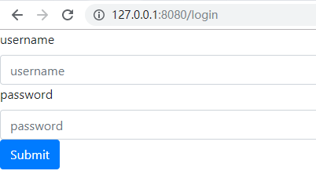

register.go:
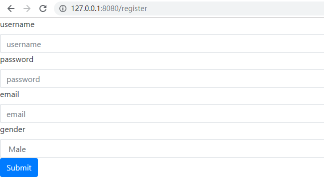

# 亮点与创新性
本实验最大的亮点是学习并使用go语言来搭建web服务，从而在一个代码里实现了能正常服务用户的全部功能函数。由于我使用了beego这个现有的框架以及go语言这个鲜为人知的语言，在文中并没有细致的代码讲解，想了解具体实现原理以及读懂代码请参考官方文档。

不过这个项目并没有完整实现图书馆里所需的一切功能，如设置管理员控制台等，并且借书要通过update这部分代码来实现，但update.go同时提供管理员用于纠正错误的图书信息，以及没有实现完善的错误管理。但作为一次练习我学习了一门新语言，并将其应用在一个实际的项目中，这整个过程是一件十分有意义的事。