# DIP实验实验报告 PB16061024 陈进泽

# 辅助函数与其解释

## 辅助函数简要介绍
`inline int** paddingImg2(int** pixelmat, int mheight, int mwidth); // padding 2 pixels`: 对原图pad两个像素，pad准则为镜像法，像素值为其对应边的镜像值，边角处使用线性插值方法。

`std::complex<double> * *dftmat(const int length, const bool inverse = false)`: 返回length$\times$length的dft变换矩阵。

`float** haarmat(const int length)`: 返回length$\times$length的haar变换矩阵。

`template<typename T = std::complex<double>> T * *matprod(T * *mat1, int x1, int y1, T * *mat2, int x2, int y2, const bool transpose = false)`: 返回mat1矩阵相乘mat2的结果，矩阵尺寸分为为(x1,y1)与(x2,y2)。

`template<typename T> T clip3(const T & min, const T & max, const T & t)`: 动态限幅函数，若t不在[min,max]区间则返回min或max，否则返回t。

`template<typename T> std::complex<double>** dft2(T** pixelmat, int mheight, int mwidth)`: 进行二维dft变换，返回值为复数矩阵。

`std::complex<double>** idft2(std::complex<double> * *pixelComp, int mheight, int mwidth)`: 二维dft反变换，返回值为复数矩阵。

`float** haar2(int** pixelmat, int mheight, int mwidth)`: 二维haar变换，返回值为未限幅与缩放结果。

## 相关代码
```cpp
inline int** paddingImg2(int** pixelmat, int mheight, int mwidth) // padding 2 pixels
{
  int** imgWithPadding = new int* [mheight + 4];
  for (int i = 0; i < mheight + 4; i++) // copy content
  {
    imgWithPadding[i] = new int[mwidth + 4];
    if (i < 2)
    {
      std::copy(pixelmat[1 - i], pixelmat[1 - i] + mwidth, imgWithPadding[i] + 2);
    }
    else if (i < mheight + 2)
    {
      std::copy(pixelmat[i - 2], pixelmat[i - 2] + mwidth, imgWithPadding[i] + 2);
      imgWithPadding[i][0] = pixelmat[i - 2][1];
      imgWithPadding[i][1] = pixelmat[i - 2][0];
      imgWithPadding[i][mwidth + 2] = pixelmat[i - 2][mwidth - 1];
      imgWithPadding[i][mwidth + 3] = pixelmat[i - 2][mwidth - 2];
    }
    else
    {
      std::copy(pixelmat[2 * mheight + 1 - i], pixelmat[2 * mheight + 1 - i] + mwidth, imgWithPadding[i] + 2);
    }
  }
  // deal with corner (0,0)
  imgWithPadding[0][1] = imgWithPadding[0][2];
  imgWithPadding[1][0] = imgWithPadding[2][0];
  imgWithPadding[0][0] = (imgWithPadding[0][1] + imgWithPadding[1][0]) >> 1;
  imgWithPadding[1][1] = (imgWithPadding[1][2] + imgWithPadding[2][1]) >> 1;

  // deal with corner (0,1)
  imgWithPadding[0][mwidth + 2] = imgWithPadding[0][mwidth + 1];
  imgWithPadding[1][mwidth + 3] = imgWithPadding[2][mwidth + 3];
  imgWithPadding[0][mwidth + 3] = (imgWithPadding[0][mwidth + 2] + imgWithPadding[1][mwidth + 3]) >> 1;
  imgWithPadding[1][mwidth + 2] = (imgWithPadding[1][mwidth + 1] + imgWithPadding[2][mwidth + 2]) >> 1;

  // deal with corner (1,0)
  imgWithPadding[mheight + 2][0] = imgWithPadding[mheight + 1][0];
  imgWithPadding[mheight + 3][1] = imgWithPadding[mheight + 3][2];
  imgWithPadding[mheight + 3][0] = (imgWithPadding[mheight + 2][0] + imgWithPadding[mheight + 3][1]) >> 1;
  imgWithPadding[mheight + 2][1] = (imgWithPadding[mheight + 1][1] + imgWithPadding[mheight + 2][2]) >> 1;

  // deal with corner (1,1)
  imgWithPadding[mheight + 2][mwidth + 3] = imgWithPadding[mheight + 1][mwidth + 3];
  imgWithPadding[mheight + 3][mwidth + 2] = imgWithPadding[mheight + 3][mwidth + 1];
  imgWithPadding[mheight + 2][mwidth + 2] = (imgWithPadding[mheight + 1][mwidth + 2] + imgWithPadding[mheight + 2][mwidth + 1]) >> 1;
  imgWithPadding[mheight + 3][mwidth + 3] = (imgWithPadding[mheight + 2][mwidth + 3] + imgWithPadding[mheight + 3][mwidth + 2]) >> 1;

  return imgWithPadding;
}

std::complex<double> * *dftmat(const int length, const bool inverse = false)
{
  std::complex<double>** mat = new std::complex<double> * [length];
  for (int i = 0; i < length; i++)
  {
    mat[i] = new std::complex<double>[length];
    for (int j = 0; j < length; j++)
    {
      mat[i][j] = std::exp((inverse ? 1. : -1.) * std::complex<double>(0, 2 * _Pi * i * j / length));
    }
  }
  return mat;
}

float** haarmat(const int length)
{
  float** mat = new float* [length];
  for (int i = 0; i < length; i++)
  {
    mat[i] = new float[length];
    int p = 0, q = 0;
    while (i >> (p + 1))
    {
      p++;
    }
    q = 1 + (i - (1 << p));
    for (int j = 0; j < length; j++)
    {
      if (i == 0)
      {
        mat[i][j] = 1 / sqrt(float(length));
      }
      else
      {
        if ((j << p) >= length * (q - 1) && (j << p) < length * q)
        {
          if ((j << p) < length * (q - 1 / 2.))
          {
            mat[i][j] = pow(2, p / 2.) / sqrt(float(length));
          }
          else
          {
            mat[i][j] = -pow(2, p / 2.) / sqrt(float(length));
          }
        }
        else
        {
          mat[i][j] = 0;
        }
      }
    }
  }
  return mat;
}

template<typename T = std::complex<double>>
T * *matprod(T * *mat1, int x1, int y1, T * *mat2, int x2, int y2, const bool transpose = false)
{

  if (y1 != y2)
  {
    exit(1);
  }
  else
  {
    T** ret = new T * [x1];
    for (int i = 0; i < x1; i++)
    {
      ret[i] = new T[y2];
      for (int j = 0; j < y1; j++)
      {
        ret[i][j] = 0;
        for (int k = 0; k < x2; k++)
        {
          if (transpose)
          {
            ret[i][j] += mat1[i][k] * mat2[j][k];
          }
          else
          {
            ret[i][j] += mat1[i][k] * mat2[k][j];
          }
        }
      }
    }
    return ret;
  }
}

template<typename T>
T clip3(const T & min, const T & max, const T & t)
{
  return std::min(std::max(t, min), max);
}

template<typename T>
std::complex<double>** dft2(T** pixelmat, int mheight, int mwidth)
{
  std::complex<double>** freq;
  std::complex<double>** pixelComp = new std::complex<double> * [mheight];
  for (int i = 0; i < mheight; i++)
  {
    pixelComp[i] = new std::complex<double>[mwidth];
    for (int j = 0; j < mwidth; j++)
    {
      pixelComp[i][j] = pixelmat[i][j];
    }
  }
  // row
  freq = matprod(dftmat(mheight), mheight, mheight, pixelComp, mheight, mwidth);
  // column
  freq = matprod(freq, mheight, mwidth, dftmat(mwidth), mwidth, mwidth);
  return freq;
}

std::complex<double>** idft2(std::complex<double> * *pixelComp, int mheight, int mwidth)
{
  // column
  pixelComp = matprod(pixelComp, mheight, mwidth, dftmat(mwidth, true), mwidth, mwidth);
  // row
  pixelComp = matprod(dftmat(mheight, true), mheight, mheight, pixelComp, mheight, mwidth);
  return pixelComp;
}

float** haar2(int** pixelmat, int mheight, int mwidth)
{
  float** freq;
  float** pixelf = new float* [mheight];
  for (int i = 0; i < mheight; i++)
  {
    pixelf[i] = new float[mwidth];
    for (int j = 0; j < mwidth; j++)
    {
      pixelf[i][j] = pixelmat[i][j];
    }
  }
  // row
  freq = matprod(haarmat(mheight), mheight, mheight, pixelf, mheight, mwidth);
  // column
  freq = matprod(freq, mheight, mwidth, haarmat(mwidth), mwidth, mwidth, true);
  return freq;
}
```

# 统计图象参数：最大值，最小值，平均值，方差，直方图统计
因本实验较简单故将所有内容放到一起
## 相关代码
```cpp
//求最大值
int maxvalue(int** pixelmat, int mheight, int mwidth)
{
  int max = 0;
  for (int i = 0; i < mheight; i++)
  {
    for (int j = 0; j < mwidth; j++)
    {
      if (pixelmat[i][j] > max)
      {
        max = pixelmat[i][j];
      }
    }
  }
  return max;
}

//求最小值
int minvalue(int** pixelmat, int mheight, int mwidth)
{
  int min = 0;
  for (int i = 0; i < mheight; i++)
  {
    for (int j = 0; j < mwidth; j++)
    {
      if (pixelmat[i][j] < min)
      {
        min = pixelmat[i][j];
      }
    }
  }
  return min;
}

//求平均值
float avgvalue(int** pixelmat, int mheight, int mwidth)
{
  float avg = 0;
  for (int i = 0; i < mheight; i++)
  {
    for (int j = 0; j < mwidth; j++)
    {
      avg += pixelmat[i][j];
    }
  }
  return avg / (mheight * mwidth);
}

//求方差
float varvalue(int** pixelmat, int mheight, int mwidth)
{
  float v2a = 0, va = 0;
  for (int i = 0; i < mheight; i++)
  {
    for (int j = 0; j < mwidth; j++)
    {
      v2a += pixelmat[i][j] * pixelmat[i][j];
      va += pixelmat[i][j];
    }
  }
  v2a /= mheight * mwidth;
  va /= mheight * mwidth;
  return v2a - va * va;
}

//统计直方图, 返回长度为256的1维数组
int* histogram(int** pixelmat, int mheight, int mwidth)
{
  //注意:函数内分配数组必须使用动态分配;
  int* hist = new int[256]();
  for (int i = 0; i < mheight; i++)
  {
    for (int j = 0; j < mwidth; j++)
    {
      hist[pixelmat[i][j]]++;
    }
  }
  return hist;
}
```

## 代码原理
遍历每个像素值进行统计。

## 结果
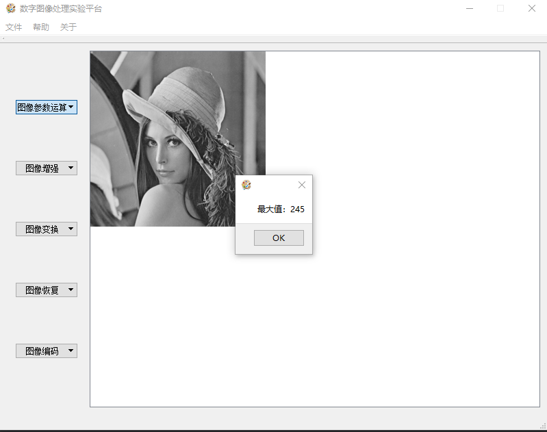
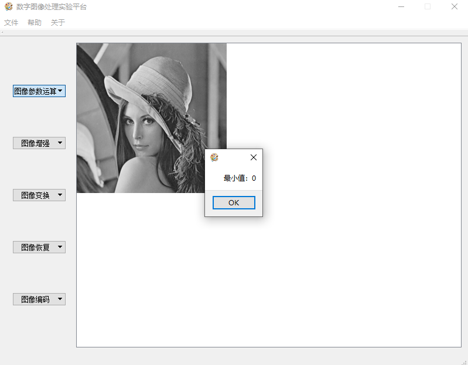

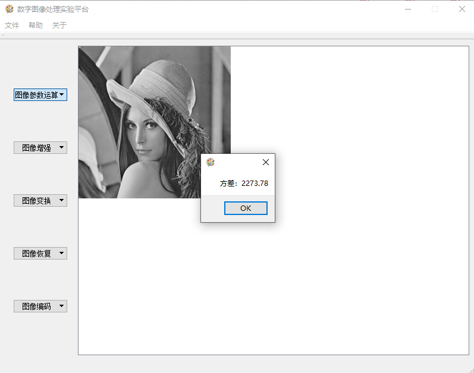
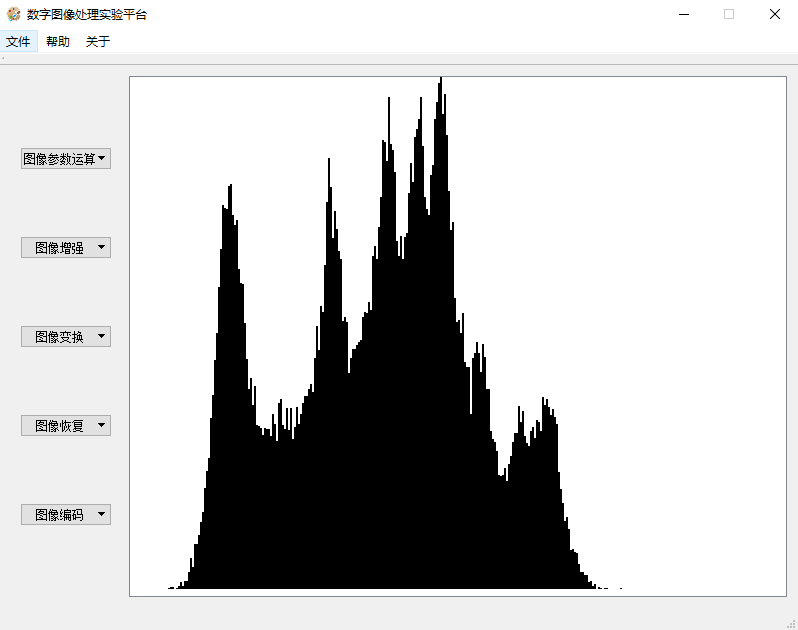

# 图像对比度增强：负片，log变换，直方图均衡，灰度线性拉伸
## 负片
### 相关代码
```cpp
//walsh变换, 返回处理后的图像
int** walsh(int** pixelmat, int mheight, int mwidth)
{
#if WALSH ...
#else
  //TODO walsh => this is minusPic
  for (int i = 0; i < mheight; i++)
  {
    for (int j = 0; j < mwidth; j++)
    {
      pixelmat[i][j] = 255 - pixelmat[i][j];
    }
  }
  return pixelmat;
#endif
}
```

### 代码原理
遍历图像计算每一点新像素值pixelmat[i][j] = 255 - pixelmat[i][j]。

### 结果
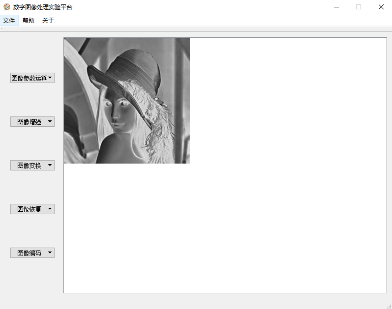

## log变换
### 相关代码
```cpp
//DCT变换, 返回处理后的图像
int** DCT(int** pixelmat, int mheight, int mwidth)
{
#if DCTTRANS ...
#else
  //TODO DCT => this is log
  for (int i = 0; i < mheight; i++)
  {
    for (int j = 0; j < mwidth; j++)
    {
      pixelmat[i][j] = 31.875 * log2(1.0 + pixelmat[i][j]);
    }
  }
  return pixelmat;
#endif
}
```

### 代码原理
遍历图像计算每一点新像素值pixelmat[i][j] = 31.875 * log2(1.0 + pixelmat[i][j])，scale值31.875=255/log2(1+255)

### 结果
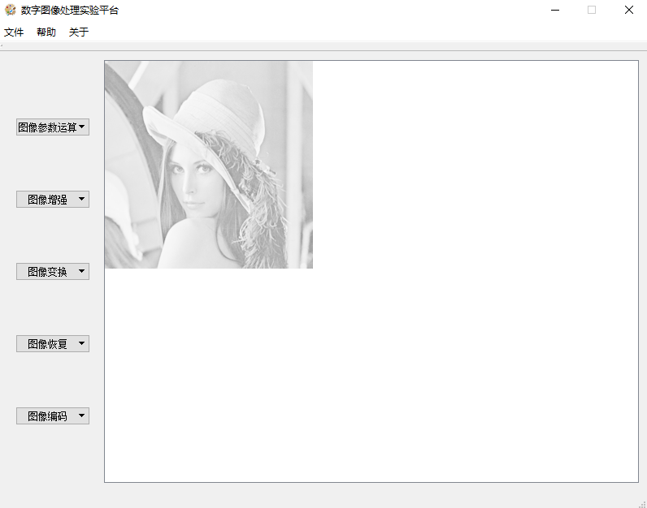

## 直方图均衡
### 相关代码
```cpp
//直方图均衡, 返回处理后的图像
int** histogramequ(int** pixelmat, int mheight, int mwidth)
{
  int* pdf = histogram(pixelmat, mheight, mwidth);
  int cdf[1 << 8], sum = 0;
  for (int i = 0; i < (1 << 8); i++)
  {
    sum += pdf[i];
    cdf[i] = sum;
  }

  for (int i = 0; i < mheight; i++)
  {
    for (int j = 0; j < mwidth; j++)
    {
      pixelmat[i][j] = cdf[pixelmat[i][j]] * 255 / sum;
    }
  }

  delete[] pdf;

  return pixelmat;
}
```

### 代码原理
使用histogram()得到pdf，对每一灰度值计算其cdf，最终遍历图像重新计算每一点像素值pixelmat[i][j] = cdf[pixelmat[i][j]] * 255 / sum。

### 结果
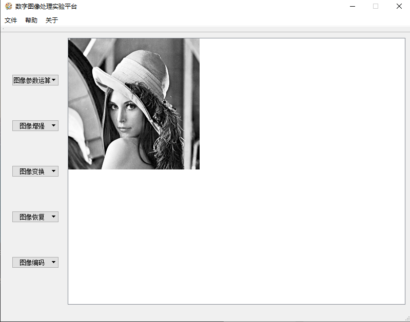

## 灰度线性拉伸
### 相关代码
```cpp
//灰度拉伸, 返回处理后的图像
int** graystretch(int** pixelmat, int mheight, int mwidth)
{
  int x1, y1, x2, y2;
  x1 = 100, y1 = 50, x2 = 200, y2 = 220;
  for (int i = 0; i < mheight; i++)
  {
    for (int j = 0; j < mwidth; j++)
    {
      if (pixelmat[i][j] < x1)
      {
        pixelmat[i][j] = pixelmat[i][j] * y1 / x1;
      }
      else if (pixelmat[i][j] < x2)
      {
        pixelmat[i][j] = (pixelmat[i][j] - x1) * (y2 - y1) / (x2 - x1) + y1;
      }
      else
      {
        pixelmat[i][j] = (pixelmat[i][j] - x2) * (255 - y2) / (255 - x2) + y2;
      }
    }
  }
  return pixelmat;
}
```

### 代码原理
选定转折点(x1,y1)，(x2,y2)得到对应的分段线性函数，遍历图像计算新像素值。

# 图像平滑
## Gaussian加噪
### 相关代码
```cpp
//生成随机噪声, 返回处理后的图像;
int** randomnoise(int** pixelmat, int mheight, int mwidth)
{
  std::default_random_engine generator;
  std::normal_distribution<double> distribution(0.0, 5.0);
  auto noise = std::bind(distribution, generator);
  for (int i = 0; i < mheight; i++)
  {
    for (int j = 0; j < mwidth; j++)
    {
      pixelmat[i][j] += noise();
    }
  }
  return pixelmat;
}
```

### 代码原理
使用标准库生成均值为0，方差为5的高斯噪声。

### 结果
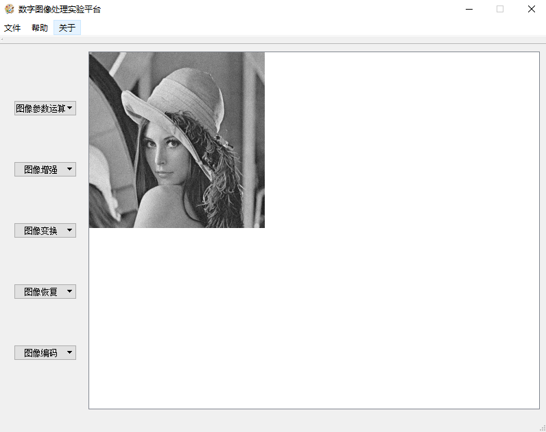

## 椒盐噪声加噪
### 相关代码
```cpp
//生成椒盐噪声, 返回处理后的图像
int** impulsenoise(int** pixelmat, int mheight, int mwidth)
{
  std::default_random_engine generator;
  std::uniform_real_distribution<double> distribution(0, 1);
  auto noise = std::bind(distribution, generator);
  const double prob = 0.05;
  for (int i = 0; i < mheight; i++)
  {
    for (int j = 0; j < mwidth; j++)
    {
      double n = noise();
      if (n < prob)
      {
        if (n < prob / 2)
        {
          pixelmat[i][j] = 0;
        }
        else
        {
          pixelmat[i][j] = 1 << 8 - 1;
        }
      }
    }
  }
  return pixelmat;
}
```

### 代码原理
生成[0,1]区间的均匀分布随机变n=noise()。若n>1-prob则不进行处理，当n<prob/2时产生椒噪声，否则残生盐噪声。

### 实验结果


## 中值滤波
### 相关代码
```cpp
//中值滤波, 返回处理后的图像
int** medianfit(int** pixelmat, int mheight, int mwidth)
{
  int** imgWithPadding = paddingImg2(pixelmat, mheight, mwidth);
  for (int i = 0; i < mheight; i++)
  {
    for (int j = 0; j < mwidth; j++)
    {
      int pattern[9];
      pattern[0] = imgWithPadding[i][j];
      pattern[1] = imgWithPadding[i][j + 4];
      pattern[2] = imgWithPadding[i + 1][j + 1];
      pattern[3] = imgWithPadding[i + 1][j + 3];
      pattern[4] = imgWithPadding[i + 2][j + 2];
      pattern[5] = imgWithPadding[i + 3][j + 1];
      pattern[6] = imgWithPadding[i + 3][j + 3];
      pattern[7] = imgWithPadding[i + 4][j];
      pattern[8] = imgWithPadding[i + 4][j + 4];

      std::sort(&pattern[0], &pattern[8]);
      pixelmat[i][j] = pattern[4];
    }
  }
  for (int i = 0; i < mheight + 4; i++)
  {
    delete[] imgWithPadding[i];
  }
  delete[] imgWithPadding;
  return pixelmat;
}
```

### 代码原理
先对图像进行padding，再使用5x5的X型区域作为参考区域进行中值滤波。中值使用stl的sort函数计算。

### 实验结果
#### 椒盐噪声
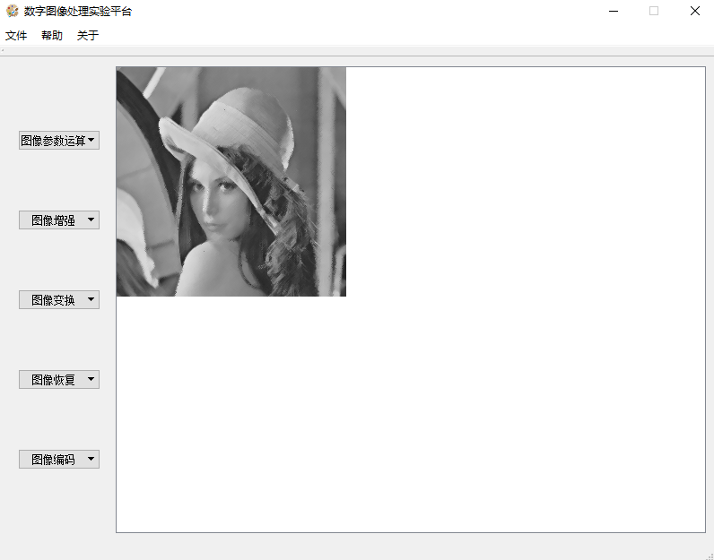
#### Gaussian噪声


## 均值滤波
### 相关代码
```cpp
//均值滤波, 返回处理后的图像
int** averagefit(int** pixelmat, int mheight, int mwidth)
{
  const int filter[3][3] = { {1,1,1},{1,1,1},{1,1,1} };
  int** imgWithPadding = paddingImg2(pixelmat, mheight, mwidth);
  for (int i = 0; i < mheight; i++)
  {
    for (int j = 0; j < mwidth; j++)
    {
      int sum = 0;
      for (int r = 0; r < 3; r++)
      {
        for (int c = 0; c < 3; c++)
        {
          sum += imgWithPadding[i + r + 1][j + c + 1] * filter[r][c];
        }
      }
      pixelmat[i][j] = sum / 9;
    }
  }
  for (int i = 0; i < mheight + 4; i++)
  {
    delete[] imgWithPadding[i];
  }
  delete[] imgWithPadding;
  return pixelmat;
}
```
### 代码原理
先对图像进行padding，再使用3x3的矩形区域求均值进行滤波。

### 实验结果
#### 椒盐噪声

#### Gaussian噪声


## 理想低通滤波
### 相关代码
```cpp
//理想低通滤波, 返回处理后的图像
int** lowpassfit(int** pixelmat, int mheight, int mwidth)
{
  std::complex<double>** freq = dft2(pixelmat, mheight, mwidth);
  constexpr int D = 30;
  for (int i = 0; i < mheight; i++)
  {
    for (int j = 0; j < mwidth; j++)
    {
      int absx, absy;
      absx = min(abs(i), abs(i - mheight));
      absy = min(abs(j), abs(j - mwidth));
      if (absx * absx + absy * absy > D * D)
      {
        freq[i][j] = 0;
      }
    }
  }
  std::complex<double>** pixelComp = idft2(freq, mheight, mwidth);
  for (int i = 0; i < mheight; i++)
  {
    for (int j = 0; j < mwidth; j++)
    {
      pixelmat[i][j] = clip3(0, 255, int(abs(pixelComp[i][j]) / (mheight * mwidth)));
    }
  }

  return pixelmat;
}
```

### 代码原理
计算原始二维dft结果，选择低频区域，最后进行反变换与动态限幅得到结果。

### 实验结果
#### 椒盐噪声

#### Gaussian噪声
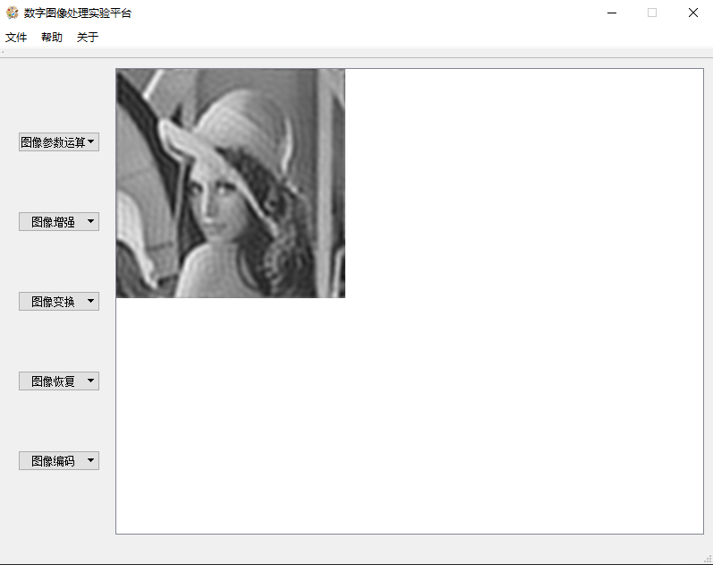

# 图像锐化
## Sobel算子
### 相关代码
```cpp
//sobel算子, 返回处理后的图像
int** sobel(int** pixelmat, int mheight, int mwidth)
{
  const int sobel[3][3] = { {1,2,1},{0,0,0},{-1,-2,-1} };
  int** imgWithPadding = paddingImg2(pixelmat, mheight, mwidth);
  for (int i = 0; i < mheight; i++)
  {
    for (int j = 0; j < mwidth; j++)
    {
      int sum = 0;
      for (int r = 0; r < 3; r++)
      {
        for (int c = 0; c < 3; c++)
        {
          sum += imgWithPadding[i + r + 1][j + c + 1] * sobel[r][c];
        }
      }
      pixelmat[i][j] = sum;
    }
  }
  for (int i = 0; i < mheight + 4; i++)
  {
    delete[] imgWithPadding[i];
  }
  delete[] imgWithPadding;

  imgWithPadding = paddingImg2(pixelmat, mheight, mwidth);
  for (int i = 0; i < mheight; i++)
  {
    for (int j = 0; j < mwidth; j++)
    {
      int sum = 0;
      for (int r = 0; r < 3; r++)
      {
        for (int c = 0; c < 3; c++)
        {
          sum += imgWithPadding[i + r + 1][j + c + 1] * sobel[c][r];
        }
      }
      pixelmat[i][j] = abs(sum);
    }
  }
  for (int i = 0; i < mheight + 4; i++)
  {
    delete[] imgWithPadding[i];
  }
  delete[] imgWithPadding;
  return pixelmat;
}
```

### 代码原理
先对图像进行padding，再先后使用两个方向的Sobel算子对原图进行卷积得到最终结果。

### 实验结果
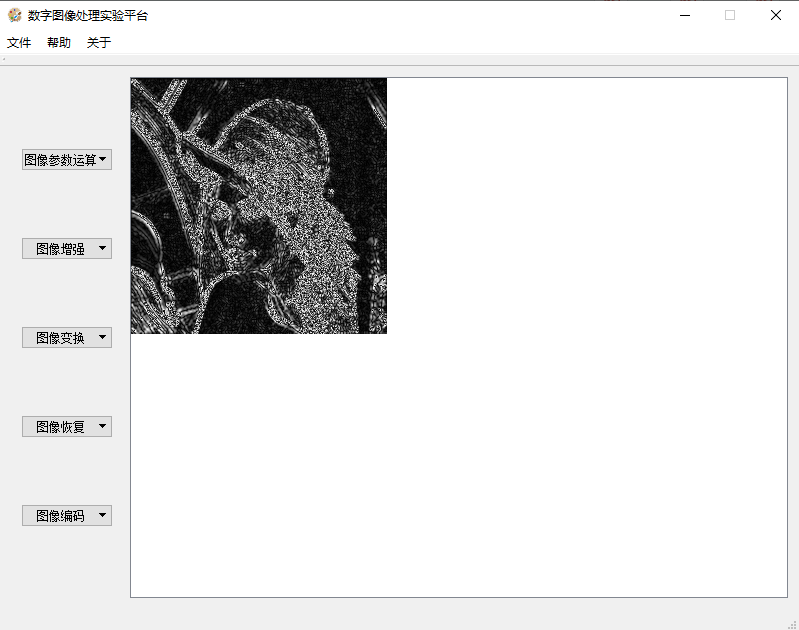

## Laplace算子
### 相关代码
```cpp
//laplace算子, 返回处理后的图像
int** laplace(int** pixelmat, int mheight, int mwidth)
{
  const int laplacian[3][3] = { {0,-1,0},{-1,4,-1},{0,-1,0} };
  int** imgWithPadding = paddingImg2(pixelmat, mheight, mwidth);
  for (int i = 0; i < mheight; i++)
  {
    for (int j = 0; j < mwidth; j++)
    {
      int sum = 0;
      for (int r = 0; r < 3; r++)
      {
        for (int c = 0; c < 3; c++)
        {
          sum += imgWithPadding[i + r + 1][j + c + 1] * laplacian[c][r];
        }
      }
      pixelmat[i][j] = abs(sum);
    }
  }
  for (int i = 0; i < mheight + 4; i++)
  {
    delete[] imgWithPadding[i];
  }
  delete[] imgWithPadding;
  return pixelmat;
}
```

### 代码原理
先对图像进行padding，再直接使用laplace算子对原图像进行卷积得到最终结果。

### 实验结果


## 理想高通滤波
### 相关代码
```cpp
//理想高通滤波, 返回处理后的图像
int** highpassfit(int** pixelmat, int mheight, int mwidth)
{
  std::complex<double>** freq = dft2(pixelmat, mheight, mwidth);
  constexpr int D = 30;
  for (int i = 0; i < mheight; i++)
  {
    for (int j = 0; j < mwidth; j++)
    {
      int absx, absy;
      absx = min(abs(i), abs(i - mheight));
      absy = min(abs(j), abs(j - mwidth));
      if (absx * absx + absy * absy < D * D)
      {
        freq[i][j] = 0;
      }
    }
  }
  std::complex<double>** pixelComp = idft2(freq, mheight, mwidth);
  for (int i = 0; i < mheight; i++)
  {
    for (int j = 0; j < mwidth; j++)
    {
      pixelmat[i][j] = clip3(0, 255, int(abs(pixelComp[i][j]) / (mheight * mwidth)));
    }
  }

  return pixelmat;
}
```

### 代码原理
与理想低通滤波正好相反，选择高频区域并进行二维dft反变换，最终进行动态限幅得到最终结果。

### 实验结果
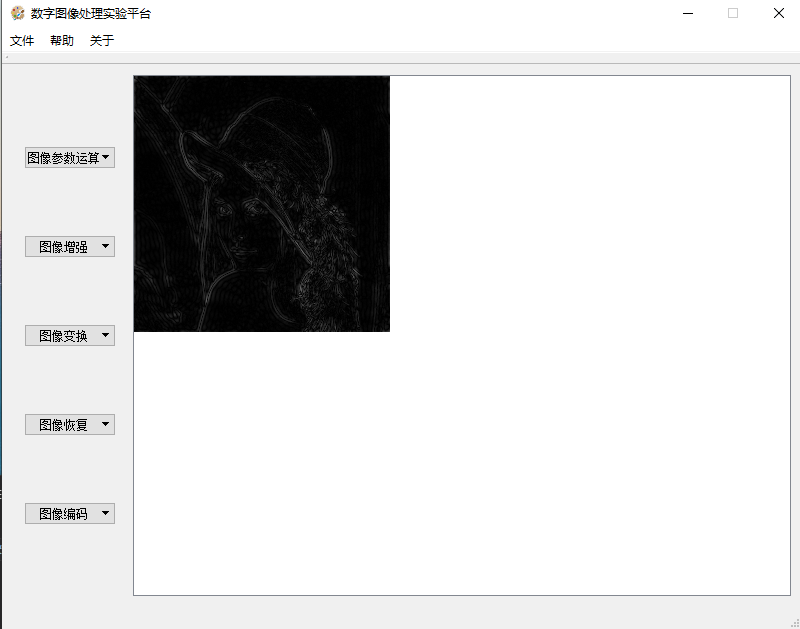

# 几何变换
## 任意角度旋转(20度)
### 相关代码
```cpp
//旋转图像, 返回显示区域(画板)指针
int** rotation(int** framemat, int** pixelmat, int mheight, int mwidth)
{
  const float theta = 20. / 180 * _Pi;
  auto rotate = [](float& x, float& y, const float& theta) { float tmpx = x * cos(theta) + y * sin(theta); float tmpy = -x * sin(theta) + y * cos(theta); x = tmpx; y = tmpy; };

  float lt[2] = { -mwidth / 2,mheight / 2 };
  float rt[2] = { mwidth / 2 - 1,mheight / 2 };
  float lb[2] = { -mwidth / 2,1 - mheight / 2 };
  float rb[2] = { mwidth / 2 - 1,1 - mheight / 2 };

  rotate(lt[0], lt[1], theta);
  rotate(rt[0], rt[1], theta);
  rotate(lb[0], lb[1], theta);
  rotate(rb[0], rb[1], theta);

  const float lm = min({ lt[0],rt[0],lb[0], rb[0] });
  const float rm = max({ lt[0],rt[0],lb[0], rb[0] });
  const float tm = max({ lt[1],rt[1],lb[1], rb[1] });
  const float bm = min({ lt[1],rt[1],lb[1], rb[1] });

  for (int y = 0; y <= tm - bm; y++)
  {
    for (int x = 0; x <= rm - lm; x++)
    {
      float tmpx = x + lm, tmpy = tm - y;
      rotate(tmpx, tmpy, -theta);

      float orix = tmpx + mwidth / 2, oriy = mheight / 2 - tmpy;
      if (orix >= 0 && orix < mwidth - 1 && oriy >= 0 && oriy < mheight - 1)
      {
        framemat[y][x]
          = pixelmat[int(oriy)][int(orix)] * (1 + floor(oriy) - oriy) * (1 + floor(orix) - orix)
          + pixelmat[int(oriy)][int(orix) + 1] * (1 + floor(oriy) - oriy) * (orix - floor(orix))
          + pixelmat[int(oriy) + 1][int(orix)] * (oriy - floor(oriy)) * (1 + floor(orix) - orix)
          + pixelmat[int(oriy) + 1][int(orix) + 1] * (orix - floor(orix)) * (oriy - floor(oriy));
      }
    }
  }

  return framemat;
}
```

### 代码原理
1. 将旋转中心选至图像中心。
2. 计算图像四个顶点在旋转之后的坐标，得到新的绘图区域[lm,rm]x[tm,bm]。
3. 对新绘图区域里的每个点，反向计算其在原图中对应坐标。如果该坐标在原图之内，则使用其临近四个像素进行双线性插值，否则不做处理。

- 坐标换算直接体现在代码里。

# 线性变换
## DFT
### 相关代码
```cpp
//DFT变换, 返回处理后的图像, 注意缩放到0~255的整型
int** DFT(int** pixelmat, int mheight, int mwidth)
{
  complex<double>** freq = dft2(pixelmat, mheight, mwidth);
  for (int i = 0; i < mheight; i++)
  {
    for (int j = 0; j < mwidth; j++)
    {
      pixelmat[i][j] = clip3(0., 255., 20 * log(std::abs(freq[i][j]) + 1));
    }
  }
  return pixelmat;
}
```

### 代码原理
本代码仅为为了显示设计的wrapper，实际代码在辅助函数中。由于我实现了矩阵相乘的代码，故DFT的过程为获得DFT矩阵->矩阵相乘。

### 实验结果
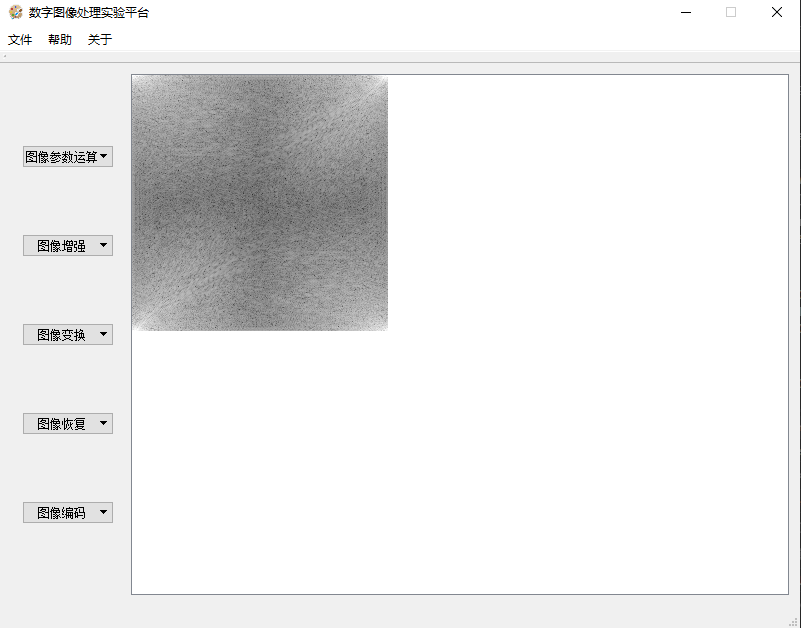

## DCT
### 相关代码
```cpp
//DCT变换, 返回处理后的图像
int** DCT(int** pixelmat, int mheight, int mwidth)
{
#if DCTTRANS
  float dctmat[8][8];
  for (int i = 0; i < 8; i++)
  {
    for (int j = 0; j < 8; j++)
    {
      if (i == 0)
      {
        dctmat[i][j] = 1 / sqrt(8);
      }
      else
      {
        dctmat[i][j] = cos(_Pi * i * (2 * j + 1) / 16) / 2;
      }
    }
  }
  for (int ydiv = 0; ydiv < mheight / 8; ydiv++)
  {
    for (int xdiv = 0; xdiv < mwidth / 8; xdiv++)
    {
      // for every 8x8 block
      float block[8][8] = { 0 };
      // col trans
      for (int row = 0; row < 8; row++)
      {
        for (int col = 0; col < 8; col++)
        {
          for (int k = 0; k < 8; k++)
          {
            block[row][col] += dctmat[row][k] * pixelmat[ydiv * 8 + k][xdiv * 8 + col];
          }
        }
      }
      // row trans
      for (int row = 0; row < 8; row++)
      {
        for (int col = 0; col < 8; col++)
        {
          float sum = 0;
          for (int k = 0; k < 8; k++)
          {
            sum += block[row][k] * dctmat[col][k];
          }
          pixelmat[ydiv * 8 + row][xdiv * 8 + col] = abs(sum);
        }
      }
    }
  }
  return pixelmat;
#else ...
#endif
}
```
### 代码原理
1. 生成DCT矩阵。
2. 对每一个分块，计算其与该矩阵左乘与右乘的的结果作为新的像素值。

### 实验结果
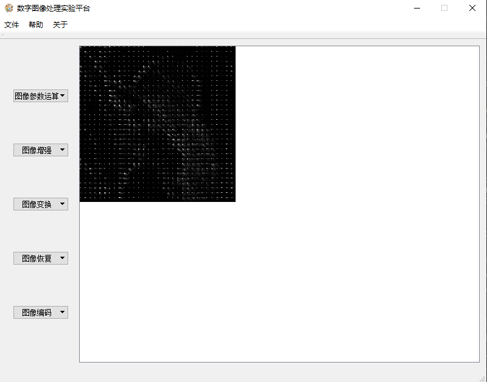

## Walsh变换
### 相关代码
``` cpp
//walsh变换, 返回处理后的图像
int** walsh(int** pixelmat, int mheight, int mwidth)
{
#if WALSH
  constexpr int walshmat[8][8] = {
    {1,1,1,1,1,1,1,1},
    {1,1,1,1,-1,-1,-1,-1},
    {1,1,-1,-1,1,1,-1,-1},
    {1,1,-1,-1,-1,-1,1,1},
    {1,-1,1,-1,1,-1,1,-1},
    {1,-1,1,-1,-1,1,-1,1},
    {1,-1,-1,1,1,-1,-1,1},
    {1,-1,-1,1,-1,1,1,-1}
  };
  for (int ydiv = 0; ydiv < mheight / 8; ydiv++)
  {
    for (int xdiv = 0; xdiv < mwidth / 8; xdiv++)
    {
      // for every 8x8 block
      int block[8][8] = { 0 };
      // col trans
      for (int row = 0; row < 8; row++)
      {
        for (int col = 0; col < 8; col++)
        {
          for (int k = 0; k < 8; k++)
          {
            block[row][col] += walshmat[row][k] * pixelmat[ydiv * 8 + k][xdiv * 8 + col];
          }
        }
      }
      // row trans
      for (int row = 0; row < 8; row++)
      {
        for (int col = 0; col < 8; col++)
        {
          pixelmat[ydiv * 8 + row][xdiv * 8 + col] = 0;
          for (int k = 0; k < 8; k++)
          {
            pixelmat[ydiv * 8 + row][xdiv * 8 + col] += block[row][k] * walshmat[col][k];
          }
        }
      }
    }
  }
  // post-processing
  for (int i = 0; i < mheight; i++)
  {
    for (int j = 0; j < mwidth; j++)
    {
      pixelmat[i][j] = abs(pixelmat[i][j]) >> 3;
    }
  }
  return pixelmat;
#else ...
#endif
}
```

### 代码原理
与DCT一致，只不过dct矩阵变成了walsh矩阵。最终有一步缩放操作，其系数值8以能量守恒为原则。

### 实验结果


## Haar变换
### 相关代码
```cpp
//haar变换, 返回处理后的图像
int** haar(int** pixelmat, int mheight, int mwidth)
{
  float** freq = haar2(pixelmat, mheight, mwidth);
  for (int i = 0; i < mheight; i++)
  {
    for (int j = 0; j < mwidth; j++)
    {
      pixelmat[i][j] = clip3(0.f, 255.f, abs(freq[i][j]));
    }
  }
  return pixelmat;
}
```

### 代码原理
与dft一致本代码仅为为了显示而设计的wrapper，真实代码在辅助函数中。由于我实现了矩阵乘法与haar矩阵生成函数剩下需要做的就是进行矩阵相乘得到最终结果。代码中也有缩放工作，其准则为能量守恒。

### 实验结果
#### 原始结果


#### 原始结果+直方图均衡


# 图像恢复
## 运动模糊图像(加噪)
### 相关代码
```cpp
#define XS 10

//示例: JPEG压缩及解压缩
int** jpeg(int** pixelmat, int mheight, int mwidth)
{
  // This is motion blur
  const int xs = XS;
  int** pixMov = new int* [mheight];
  for (int r = 0; r < mheight; r++)
  {
    pixMov[r] = new int[mwidth];
    for (int c = 0; c < mwidth; c++)
    {
      int sum = 0;
      for (int x = 0; x < xs; x++)
      {
        sum += pixelmat[r][uint8_t(c - x)];
      }
      pixMov[r][c] = sum / xs;
    }
  }
  for (int r = 0; r < mheight; r++)
  {
    for (int c = 0; c < mwidth; c++)
    {
      pixelmat[r][c] = pixMov[r][c];
    }
  }
  return pixelmat;
}
```

### 代码原理
运动模糊的数学模型是积分，本代码即是使用积分算子对原图像进行了循环卷积。运动方向为x方向。

### 实验结果
#### 不加噪
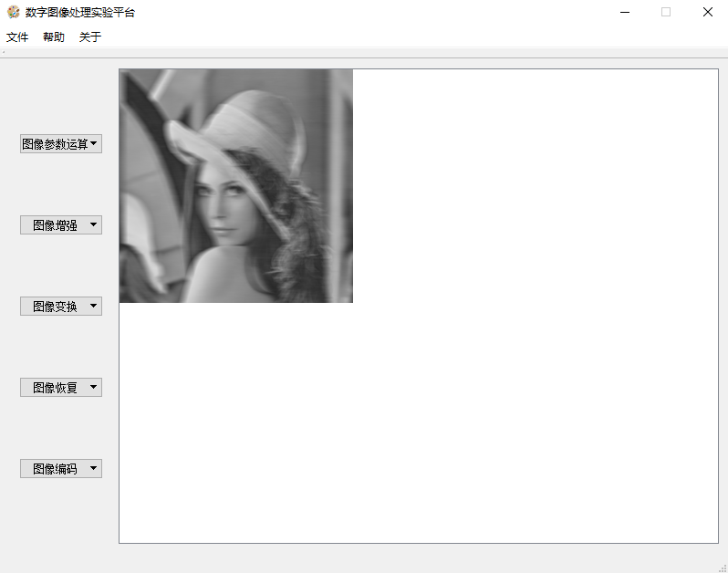

#### 加噪


## 逆滤波
### 相关代码
```cpp
//逆滤波复原
int** inversefit(int** pixelmat, int mheight, int mwidth)
{
#if INVFIT
  const int xs = XS;
  const double threshold = 0.01;
  complex<double>** freqPel = dft2(pixelmat, mheight, mwidth);
  complex<double>* freqFit = new complex<double>[mwidth];
  for(int i = 0; i < mwidth; i++)
  {
    for(int j = 0; j < xs; j++)
    {
      freqFit[i] += exp( -complex<double>(0, 2. * _Pi / mwidth * i * j)) / double(xs);
    }
  }
  for(int r = 0; r < mheight; r++)
  {
    for(int c = 0; c < mwidth; c++)
    {
      if(abs(freqFit[c]) > threshold)
      {
        freqPel[r][c] /= freqFit[c];
      }
    }
  }

  complex<double>** pelOri = idft2(freqPel, mheight, mwidth);
  for(int r = 0; r < mheight; r++)
  {
    for(int c = 0; c < mwidth; c++)
    {
      pixelmat[r][c] = clip3(0., 255., abs(pelOri[r][c]) / (mheight * mwidth));
    }
  }
  return pixelmat;
#else ...
#endif
}
```

### 代码原理
本代码里利用用运动模糊的冲激响应函数对原图进行反卷积，其中为了避免零值的出现设置一阈值，仅处理高于次阈值的频率系数，最后对图像进行缩放与动态限幅。

### 实验结果
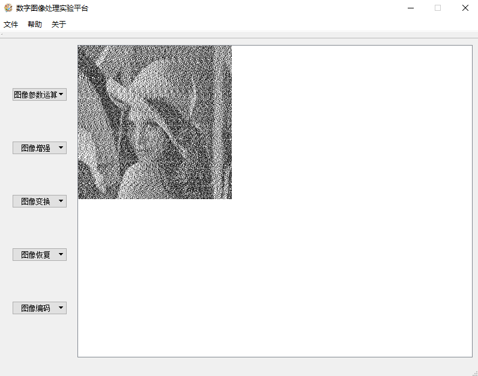

### 实验结果分析
如图可见逆滤波的效果并不好，这说明逆滤波对噪声十分敏感，作为参考下图是未加噪情况下逆滤波结果。

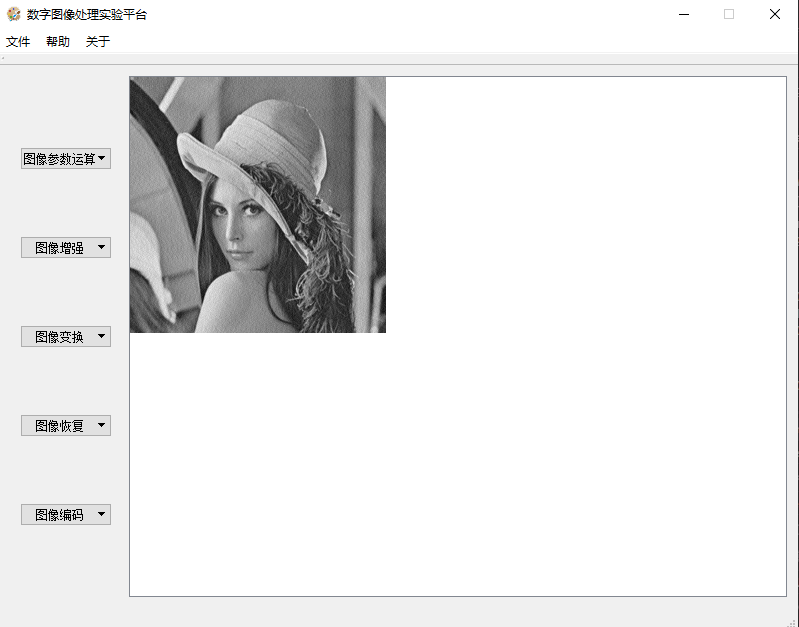

可见就算没有噪声，逆滤波的结果也像是添加了随机噪声。

## 维纳滤波
### 相关代码
```cpp
//维纳滤波
int** wienerfit(int** pixelmat, int mheight, int mwidth)
{
  const int xs = XS;
  const double K = 0.01;
  complex<double>** freqPel = dft2(pixelmat, mheight, mwidth);
  complex<double>* freqFit = new complex<double>[mwidth];
  for (int i = 0; i < mwidth; i++)
  {
    for (int j = 0; j < xs; j++)
    {
      freqFit[i] += exp(-complex<double>(0, 2. * _Pi / mwidth * i * j)) / double(xs);
    }
  }
  for (int r = 0; r < mheight; r++)
  {
    for (int c = 0; c < mwidth; c++)
    {
      freqPel[r][c] *= conj(freqFit[c]) / (pow(abs(freqFit[c]),2)+K);
    }
  }
  complex<double>** pelOri = idft2(freqPel, mheight, mwidth);
  for (int r = 0; r < mheight; r++)
  {
    for (int c = 0; c < mwidth; c++)
    {
      pixelmat[r][c] = clip3(0., 255., abs(pelOri[r][c]) / (mheight * mwidth));
    }
  }
  return pixelmat;
}
```

### 代码原理
与wenier滤波原理一致，设定一固定值K并计算恢复出来的频谱freqPel[r][c] *= conj(freqFit[c]) / (pow(abs(freqFit[c]),2)+K)，最后进行反变换、缩放以及限幅。

### 实验结果
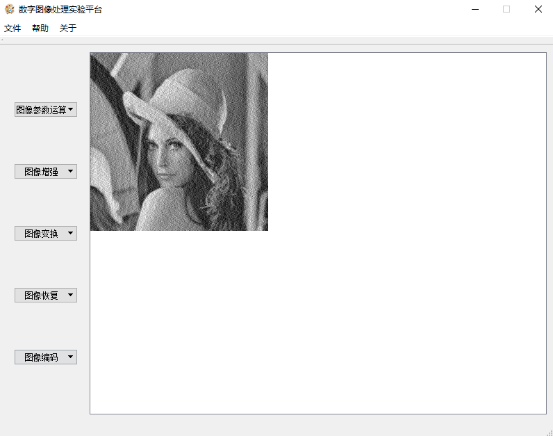

### 实验结果分析
如图可见相比逆滤波来说维纳滤波在加噪图像情况下能更好地恢复出原图，体现了其均方误差最小的特性。