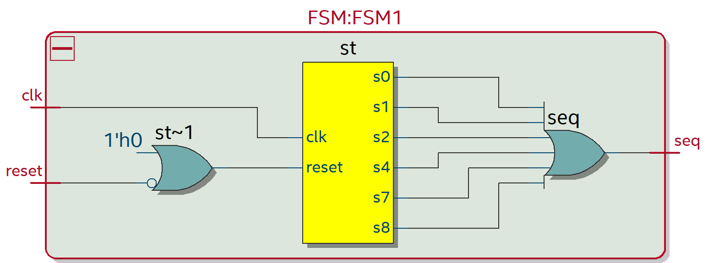
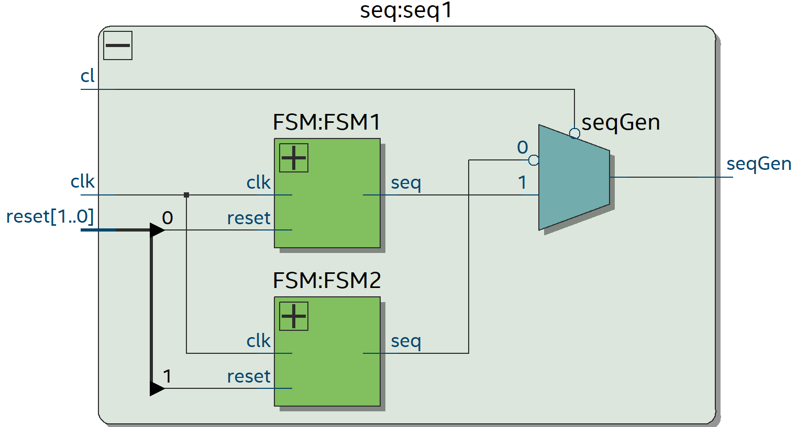
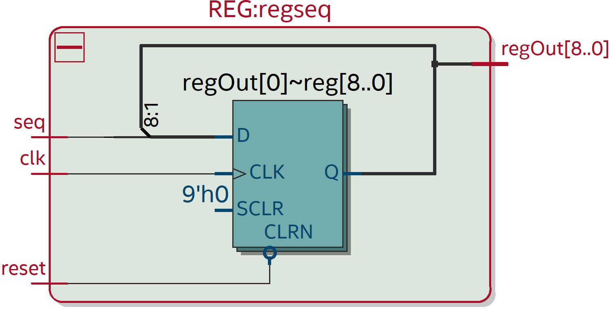
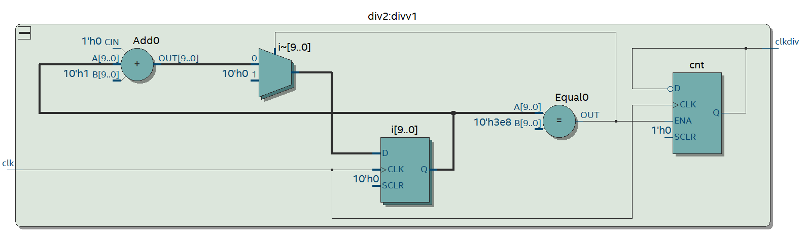
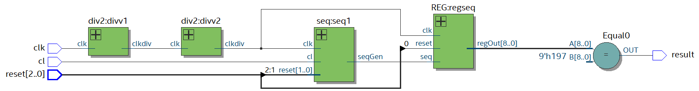
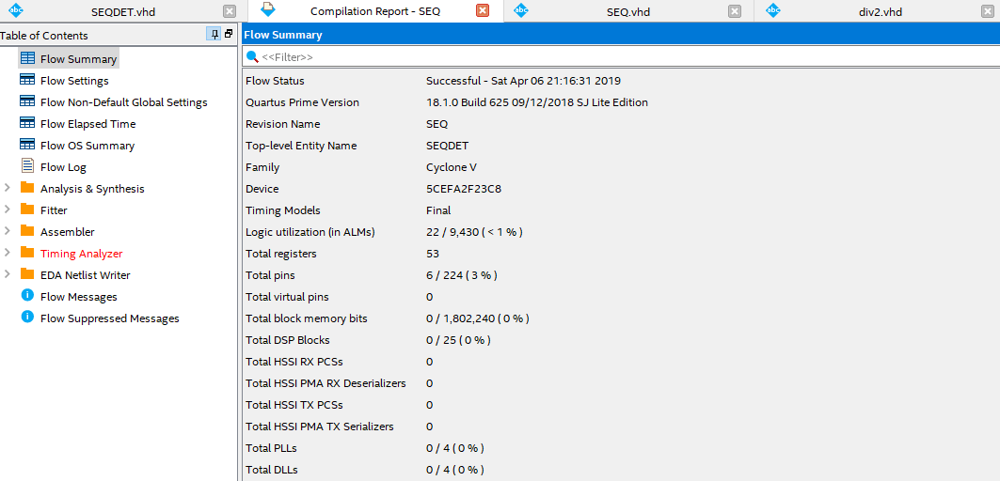
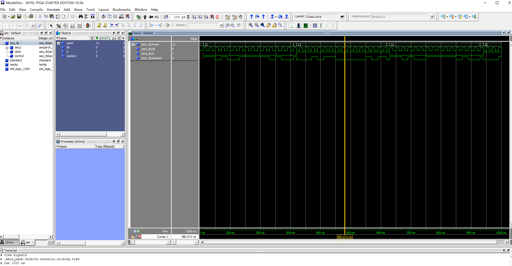
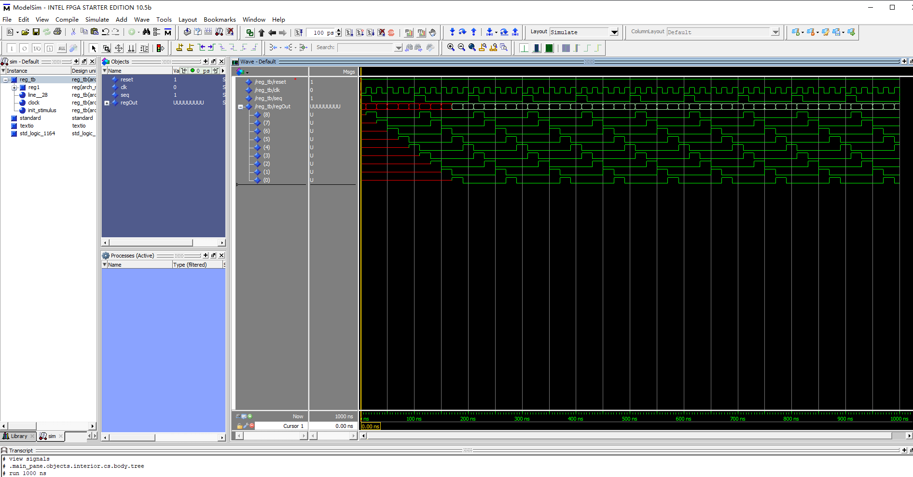
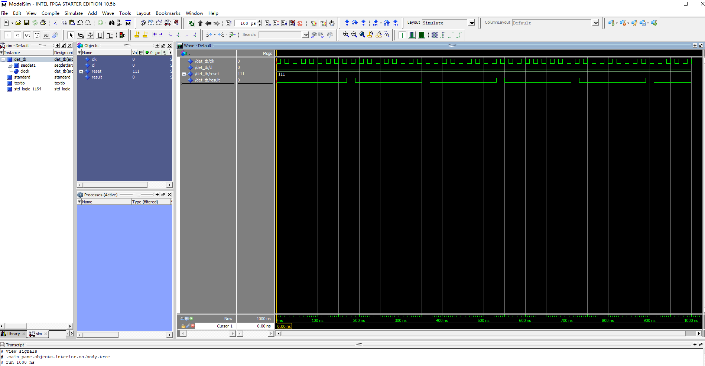
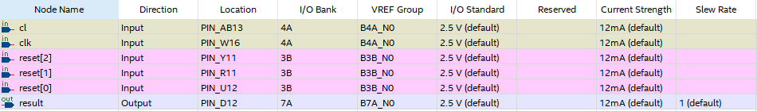

# 序列检测器的设计实验报告 PB16061024 陈进泽

# 实验内容
1. 用VHDL实现两个序列产生器模块, 其中一个包含"11101011"序列, 另一个不包含。
2. 设计二选一多路选择器来选择一个序列产生器输出。
3. 用VHDL对输出的序列进行检测并判断该序列是哪个模块产生的。
4. 为设计工程天机约束, 管脚分配。
5. 完成硬件验证。

# 设计分析
本实验可分为四个模块设计: 序列产生器、二选一多路选择器、n位移位寄存器以及序列检测器, 其中为了让输出肉眼可见还设计了分频器。

因为考虑到通用性问题, 我没有采用状态机实现序列检测, 而是使用移位寄存器来实现这个目的。

序列检测器用来检测移位寄存器的buffer是否与特定序列一致, 若一致输出高电平, 否则输出低电平, 语句放在并发区域内以便随时执行。

*本实验为了编写代码方便并未写两个序列产生器, 而是采用实例化两个同样的序列产生器而对第二个取反的方式来生成两个序列。

# 源代码
## 序列产生器
```vhdl
library ieee;
use ieee.std_logic_1164.all;

entity FSM is
  port(
    reset: in std_logic;
    clk: in std_logic;
    seq: out std_logic
  );
end FSM;

architecture arch_FSM of FSM is
  type states is(s0,s1,s2,s3,s4,s5,s6,s7,s8);
  signal st: states;
begin
  process(clk, reset)
  begin
    if(reset='0') then
      st <= s0;
    elsif(clk'event and clk='1') then
      case st is
        when s0 => st <= s1;
        when s1 => st <= s2;
        when s2 => st <= s3;
        when s3 => st <= s4;
        when s4 => st <= s5;
        when s5 => st <= s6;
        when s6 => st <= s7;
        when s7 => st <= s8;
        when s8 => st <= s0;
      end case;
    end if;
  end process;

  seq <= '1' when(st = s0 or st = s1 or st = s2 or st = s4 or st = s7 or st = s8) else '0';

end arch_FSM;
```
本代码实现了一个9状态的状态机, 输出置于并发区间以便随时变更输出, 当状态为指定状态时输出高电平, 否则输出低电平。电路图见下图:



## 二选一多路选择器
```vhdl
library ieee;
use ieee.std_logic_1164.all;

entity seq is
  port(
    reset: in std_logic_vector(1 downto 0);
    clk: in std_logic;
    cl: in std_logic;
    seqGen: out std_logic
  );
end seq;

architecture arch_seq of seq is
  component FSM
    port(
      reset: in std_logic;
      clk: in std_logic;
      seq: out std_logic
    );
  end component;
  signal intraOutput: std_logic_vector(1 downto 0);
begin
  FSM1: FSM port map(reset(0), clk, intraOutput(0));
  FSM2: FSM port map(reset(1), clk, intraOutput(1));
  seqGen <= intraOutput(0) when cl = '0' else not intraOutput(1) when cl = '1' else 'U';
end arch_seq;
```
`cl`为控制信号, 当`cl`置0时选择状态机1输出, 当`cl`置1时选择状态机2输出, 当都不是时输出置为'U', 有两个`reset`是因为考虑到两个状态机不同步复位。电路原理图如下:



## n位移位寄存器
```vhdl
library ieee;
use ieee.std_logic_1164.all;

entity REG is
  generic(width: INTEGER:=9);
  port(
    reset: in std_logic;
    seq: in std_logic;
    clk: in std_logic;
    regOut: buffer std_logic_vector(width-1 downto 0)
  );
end REG;

architecture arch_REG of REG is
begin
  process(clk, reset)
  begin
    if(reset = '0') then
      regOut <= (others=>'0');
    elsif(clk'event and clk='1') then
      regOut(width-2 downto 0) <= regOut(width-1 downto 1);
      regOut(width-1) <= seq;
    end if;
  end process;
end arch_REG;
```

代码里选择了带参数的设计, 方便于以后使用。`reset`将所有输出buffer全部置0, 每当一个上升沿到来时均移一次位。电路原理图如下:



## 分频器
```vhdl
library ieee;
use ieee.std_logic_1164.all;

entity div2 is
  port(
    clk: in std_logic;
    clkdiv: out std_logic
  );
end div2;

architecture arch_div2 of div2 is
  signal cnt: std_logic:='1';
begin
  process(clk)
    variable i: integer range 0 to 1000 :=0;
  begin
    if(clk'event and clk='1') then
      if(i=1000) then
        i :=0;
        cnt <= not cnt;
      else
        i:= i+1;
      end if;
    end if;
  end process;
  
  clkdiv <= cnt;
end arch_div2;
```

本电路通过内部的计数器实现了1000分频的功能(准确来说是1001分频)。其中采用signal cnt作为中间信号的理由是out端口不能读值。电路原理图如下:



## 整体结构
```vhdl
library ieee;
use ieee.std_logic_1164.all;

entity SEQDET is
  port(
    clk: in std_logic;
    cl: in std_logic;
    reset: in std_logic_vector(2 downto 0);
    result: out std_logic
  );
end SEQDET;

architecture arch_SEQDET of SEQDET is
  component REG is
    generic(width: INTEGER:=9);
    port(
      reset: in std_logic;
      seq: in std_logic;
      clk: in std_logic;
      regOut: buffer std_logic_vector(width-1 downto 0)
    );
  end component;

  component seq is
    port(
      reset: in std_logic_vector(1 downto 0);
      clk: in std_logic;
      cl: in std_logic;
      seqGen: out std_logic
    );
  end component;
  
  component div2 is
  port(
    clk: in std_logic;
    clkdiv: out std_logic
  );
  end component;

  signal regist: std_logic_vector(8 downto 0);
  signal seqgen: std_logic;
  signal clk1: std_logic;
  signal clk2: std_logic;
begin
  seq1: SEQ port map(reset(2 downto 1), clk2, cl, seqgen);
  regseq: REG generic map(9) port map(reset(0), seqgen, clk2, regist);
  divv1: div2 port map(clk,clk1);
  divv2: div2 port map(clk1,clk2);

  result <= '1' when(regist="110010111") else '0';
end arch_SEQDET;
```
设置两个分频器以对50MHz时钟进行1,000,000分频。当检测到移位寄存器内buffer正好为待检测序列(其实为序列的倒序)时输出一个高电平, 否则输出低电平。电路原理图如下:



## 编译结果


# 仿真结果
本段内提供三个程序的仿真, 分别为序列产生器, 移位寄存器以及未分频的整体仿真结果。

## 序列产生器
```vhdl
library ieee;
use ieee.std_logic_1164.all;

entity SEQ_tb is
end SEQ_tb;

architecture arch_tb of SEQ_tb is
  component SEQ is
    port(
      reset: in std_logic_vector(1 downto 0);
      clk: in std_logic;
      cl: in std_logic;
      seqGen: out std_logic
    );
  end component;

  signal reset: std_logic_vector(1 downto 0);
  signal clk: std_logic;
  signal cl: std_logic;
  signal seqGen: std_logic;

begin

  seq1: SEQ port map(reset, clk, cl, seqGen);
  clock: process
  begin
    clk <= '0';
    wait for 10 ns;
    clk <= '1';
    wait for 10 ns;
  end process clock;
  
  control: process
  begin
    reset <= "00";
    wait for 10 ns;
    reset <= "11";
    cl <= '0';
    wait for 300 ns;
    reset <= "00";
    wait for 10 ns;
    reset <= "11";
    cl <= '1';
    wait for 300 ns;
  end process control;
end arch_tb;
```
cl电平每300ns变动一次, 同时重置所有序列产生器, 仿真结果如下:


* 可见正确输出了指定序列

## 移位寄存器
```vhdl
library ieee;
use ieee.std_logic_1164.all;

entity REG_tb is
end REG_tb;

architecture arch_tb of REG_tb is
  component REG is
  generic(width: INTEGER:=9);
  port(
    reset: in std_logic;
    seq: in std_logic;
    clk: in std_logic;
    regOut: buffer std_logic_vector(width-1 downto 0)
  );
  end component;

  signal reset: std_logic;
  signal clk: std_logic;
  signal seq: std_logic;
  signal regOut: std_logic_vector(8 downto 0);

begin
  reg1: REG port map(reset, seq, clk, regOut);
  reset <= '1';
  clock: process
  begin
    clk <= '0';
    wait for 10 ns;
    clk <= '1';
    wait for 10 ns;
  end process clock;

  init_stimulus: process
  begin
    seq <= '1';
    wait for 20 ns;
    seq <= '0';
    wait for 80 ns;
  end process init_stimulus;
end arch_tb;
```
每100ns产生一个持续20ns的高电平, 观察其进入9位移位寄存器的结果, 仿真结果如下:


* 可见移位寄存器与想定的一样工作

## 整体仿真
```vhdl
library ieee;
use ieee.std_logic_1164.all;

entity DET_tb is
end DET_tb;

architecture arch_tb of DET_tb is
  component SEQDET is
    port(
      clk: in std_logic;
      cl: in std_logic;
      reset: in std_logic_vector(2 downto 0);
      result: out std_logic
    );
  end component;

  signal clk: std_logic;
  signal cl: std_logic:='0';
  signal reset: std_logic_vector(2 downto 0):="111";
  signal result: std_logic;
begin
  seqdet1: SEQDET port map(clk,cl,reset,result);

  clock: process
  begin
    clk <= '0';
    wait for 10 ns;
    clk <= '1';
    wait for 10 ns;
  end process clock;

end arch_tb;
```
所有原件都被包含在`SEQDET`元件内, 仿真结果如下:


* 可见每隔一定时间序列检测器都会输出一个高电平来表示已检测到输出

# FPGA验证结果
## 引脚分配


reset0-2置为拨码开关0-2, clk置为50MHz时钟, cl置为拨码开关4, 检测器输出置为LED0。

## 实验结果
拨码开关0-2始终置为高电平, cl置为低电平, LED0有规律地闪烁, 代表检测到待定序列。cl置为高电平则LED0不亮, 表示没有检测到待定序列。

# 实验总结
本次实验让我较为完整的感受到了VHDL编译, 仿真, 硬件验证的整体流程。其中感触比较深的是vhdl编程思路与以往学过的编程语言的不同, 设计时需要在脑袋里有对整体电路的印象才能写出代码, 而不是像C一类的编程语言一样有很多技巧可循。

本次实验中我尝试了很多新的思路与方法, 最开始是想写一个通用性极高, 可以检测任意长度任意序列的程序, 所以设计了移位寄存器而不是状态机来检验输出序列。虽然因为对vhdl语言的了解不深入或者根本就不可能做到我最终写了一个能方便地检测任意长度一定的已知序列的程序。

除此之外这次实验中我在仿真部分浪费了较多时间, 因为仿真top entity时无法检查到其子器件的引脚输出。最终我通过在do文件里添加语句`log =r *`以及手动运行modelsim来达到了想要的效果, 这过程中我对Quartus这个软件的结构又有了更深的理解。