# 七段数码管动态显示电路设计实验报告 PB16061024 陈进泽

# 实验内容
1. 用VHDL 设计一个电路，实现在8 位七段数码管上同时显示不同的数据(0~9，A~F)。而且要求可以通过拨码开关控制在不同的数码管上显示不同的数。设计基本结构如下:
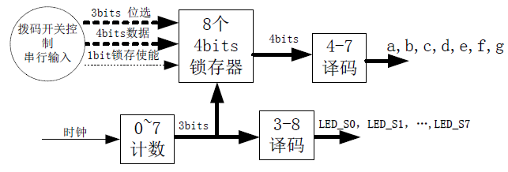
2. 编写VHDL test bench，设置相关参数，完成功能仿真。
3. 查看RTL 级的电路原理图。
4. 完成管脚的分配。
5. 实现硬件验证。

# 设计分析
上图仅为一示意图，但可大体将整个电路分为锁存器、4-7译码器、计数器核输入控制部分。

由于数码管连接采用总线型结构，为实现数码管同时显示需要根据时钟信号控制在每个时刻哪个数码管有输出，读取其显示数字对应的锁存器输出并将其放到数据上。

为控制显示数字，需要在输入端选择对应锁存器并将总线数据使能输出到该锁存器上，由于有8个数码管共需8个4bits锁存器，对应有3bits的地址线和1bit锁存使能，以及4bits的数据线。

本实验分为7个原件实现功能，分别为SR锁存器、8选1数据选择器、8路使能信号输出、SR锁存器阵列、4-7译码器、分频器以及总工程。分频器目的为减少门电路带来的时间延迟的影响。

# 源代码
## SR锁存器
```vhdl
library ieee;
use ieee.std_logic_1164.all;

entity sr_latch is
  generic(width: INTEGER:=4);
  port(
    latchIn: in std_logic_vector(width-1 downto 0);
    latchOut: out std_logic_vector(width-1 downto 0);
    ena: in std_logic;
	 clr: in std_logic
  );
end sr_latch;

architecture arch_latch of sr_latch is
begin
  process(ena, clr, latchIn)
  begin
    if(clr = '0') then
      latchOut <= (others=>'0');
    elsif(ena='1') then
      latchOut <= latchIn;
    end if;
  end process;
end arch_latch;
```
该元件读取输入信号，并在有使能信号的情况下将输入信号放到输出端口，其他时刻无论输入如何输出均不变。电路原理图如下:

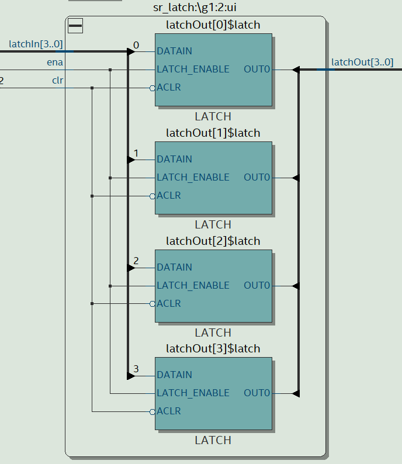

## 8选1数据选择器
```vhdl
library ieee;
use ieee.std_logic_1164.all;

entity SELECT8 is
generic(num: integer:=4);
  port (
    clkin: in std_logic_vector(7 downto 0);
    selout: out std_logic_vector(num-1 downto 0);
    sel: in std_logic_vector(8 * num - 1 downto 0)
  );
end entity SELECT8;

architecture arch_sel8 of SELECT8 is
  
begin
  process(clkin)
  begin
    case clkin is
      when "00000001" => selout <= sel(1 * num - 1 downto 0 * num);
      when "00000010" => selout <= sel(2 * num - 1 downto 1 * num);
      when "00000100" => selout <= sel(3 * num - 1 downto 2 * num);
      when "00001000" => selout <= sel(4 * num - 1 downto 3 * num);
      when "00010000" => selout <= sel(5 * num - 1 downto 4 * num);
      when "00100000" => selout <= sel(6 * num - 1 downto 5 * num);
      when "01000000" => selout <= sel(7 * num - 1 downto 6 * num);
      when "10000000" => selout <= sel(8 * num - 1 downto 7 * num);
    
      when others => selout <= (others => 'U');
    end case;
  end process;
end architecture arch_sel8;
```
本代码通过信号连接的方式实现了一种n位8选1数据选择器。电路原理图如下:

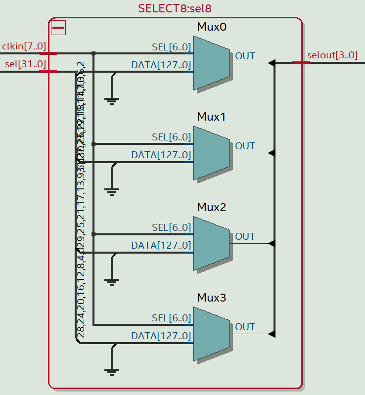

## 8路使能信号输出
```vhdl
library ieee;
use ieee.std_logic_1164.all;

entity enagen is
  generic(num: integer:=8);
  port(
    clk: in std_logic;
    enaout: buffer std_logic_vector(num-1 downto 0)
  );
end enagen;

architecture arch_enagen of enagen is
begin
  process(clk)
    variable i: integer range 0 to num-1 := 0;
    begin
      if(clk'event and clk='1') then
        enaout(num-2 downto 0) <= enaout(num-1 downto 1);
        if(i = num-1) then
          i := 0;
          enaout(num-1) <= '1';
        else
          i := i + 1;
          enaout(num-1) <= '0';
        end if;
      end if;
  end process;
end arch_enagen;
```
本代码省去了3-8译码器的步骤，直接输出8路使能信号，并且采用了移位寄存器的形式来实现，最终以较少的ALM单元实现了完整的功能。电路原理图如下:

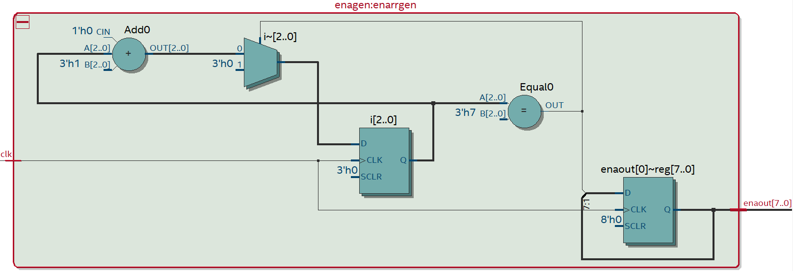

## SR锁存器阵列
```vhdl
library ieee;
use ieee.std_logic_1164.all;

entity SR_ARRAY is
  port (
    enarr: in std_logic_vector(7 downto 0);
    clarr: in std_logic_vector(7 downto 0);
    ensav: in std_logic;
    sel: in std_logic_vector(2 downto 0);
    busin: in std_logic_vector(3 downto 0);
    busout: out std_logic_vector(3 downto 0)
  );
end entity SR_ARRAY;

architecture arch_srarr of SR_ARRAY is
  component sr_latch
    generic(width: INTEGER:=4);
    port(
      latchIn: in std_logic_vector(width-1 downto 0);
      latchOut: out std_logic_vector(width-1 downto 0);
      ena: in std_logic;
      clr: in std_logic
    );
  end component;

  component SELECT8 is
  generic(num: integer:=4);
    port (
      clkin: in std_logic_vector(7 downto 0);
      selout: out std_logic_vector(num-1 downto 0);
      sel: in std_logic_vector(8 * num - 1 downto 0)
    );
  end component;
  
  signal latchOut: std_logic_vector(31 downto 0);
  signal selsr: std_logic_vector(7 downto 0);
begin

  g1: for i in 7 downto 0 generate
    ui : sr_latch generic map(4) port map(busin, latchOut(4 * i + 3 downto 4 * i) , selsr(i), clarr(i));
  end generate g1;

  sel8: select8 generic map(4) port map(enarr, busout, latchOut);

  process(ensav, sel)
  begin
    if(ensav='1') then
      case sel is
        when "000" => selsr <= "00000001";
        when "001" => selsr <= "00000010";
        when "010" => selsr <= "00000100";
        when "011" => selsr <= "00001000";
        when "100" => selsr <= "00010000";
        when "101" => selsr <= "00100000";
        when "110" => selsr <= "01000000";
        when "111" => selsr <= "10000000";
      
        when others => selsr <= "00000000";
      end case;
    else
      selsr <= "00000000";
    end if;
  end process;


end architecture arch_srarr;
```
本代码例化了8个SR锁存器和一个8选一数据选择器，并配置了选择输入端以及输出端，实现了在每一个合理的ena阵列信号输入的情况下选择一个锁存器将其锁存数据布置到总线输出端口上的功能。电路原理图如下:

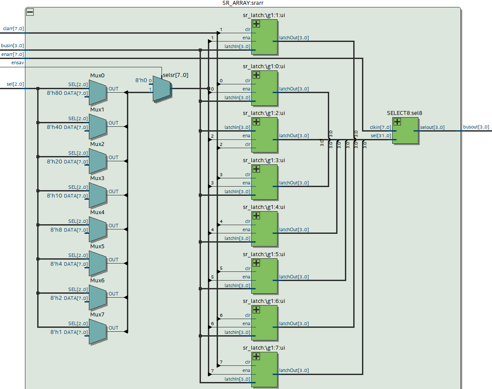

## 4-7译码器
```vhdl
library ieee;
use ieee.std_logic_1164.all;

entity LED_TRANS is
  port (
    busin: in std_logic_vector(3 downto 0);
    ledout: out std_logic_vector(6 downto 0)
  );
end entity LED_TRANS;

architecture rtl of LED_TRANS is
  
begin
  process(busin)
  begin
    case busin is
      when "0000" => ledout <= "0000001";
      when "0001" => ledout <= "1001111";
      when "0010" => ledout <= "0010010";
      when "0011" => ledout <= "0000110";
      when "0100" => ledout <= "1001100";
      when "0101" => ledout <= "0100100";
      when "0110" => ledout <= "0100000";
      when "0111" => ledout <= "0001111";
      when "1000" => ledout <= "0000000";
      when "1001" => ledout <= "0001100";
      when "1010" => ledout <= "0001000";
      when "1011" => ledout <= "1100000";
      when "1100" => ledout <= "0110001";
      when "1101" => ledout <= "1000010";
      when "1110" => ledout <= "0110000";
      when "1111" => ledout <= "0111000";
        
      when others => ledout <= "1000000";
        
    end case;
  end process;
  
  
end architecture rtl;
```
本代码根据7段数码管原理设计对应的译码方案。电路原理图如下:

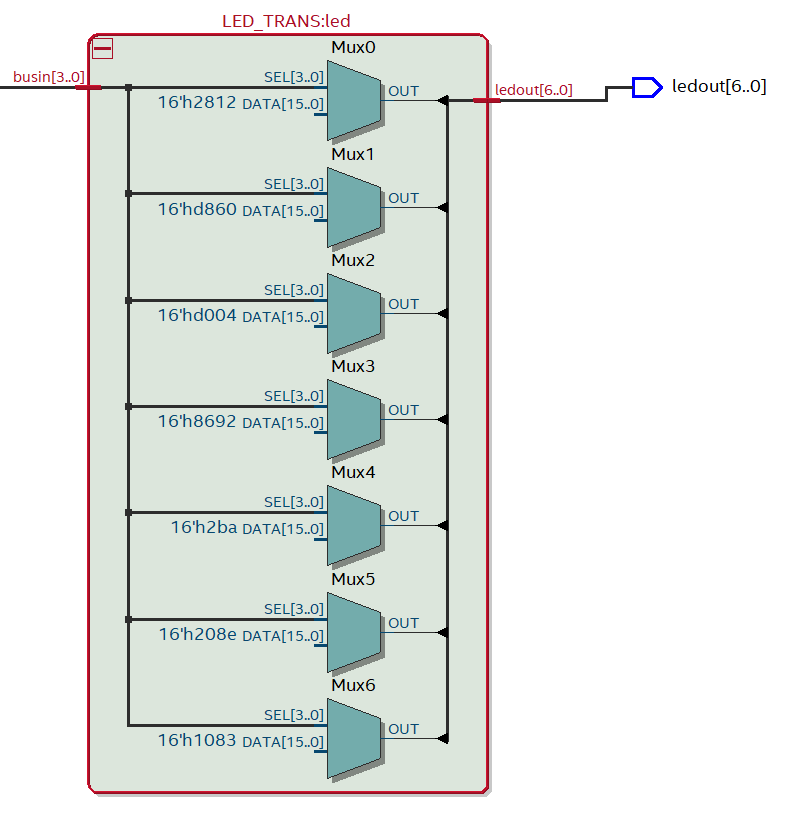

## 分频器
```vhdl
library ieee;
use ieee.std_logic_1164.all;

entity div2 is
  port(
    clk: in std_logic;
	 clkdiv: out std_logic
  );
end div2;
 
architecture rtl of div2 is
  signal cnt: std_logic:='1';

begin
  process(clk)
  variable i: integer range 0 to 999 := 0;
  begin
  if(clk'event and clk='1') then
    if(i=999) then
	   i:=0;
		cnt<=not cnt;
	 else
	  i:=i+1;
	 end if;
  end if;
  end process;
  
  clkdiv <= cnt;
end rtl;
```
本代码实现了1000分频的功能，给了门电路足够的缓冲时间来完成其所必要的功能。电路原理图如下:

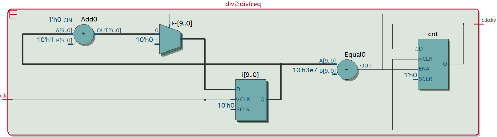

## 总工程
```vhdl
library ieee;
use ieee.std_logic_1164.all;

entity SEVEN_SEG_LED is
  port (
    clk: in std_logic;
    clarr: in std_logic_vector(7 downto 0);
	  enaarr: out std_logic_vector(7 downto 0);
    ensav: in std_logic;
    sel: in std_logic_vector(2 downto 0);
    busin: in std_logic_vector(3 downto 0);
    ledout: out std_logic_vector(6 downto 0)
  );
end entity SEVEN_SEG_LED;

architecture arch_7segled of SEVEN_SEG_LED is
  signal busout: std_logic_vector(3 downto 0);
  signal enarr: std_logic_vector(7 downto 0);
  signal clkdiv: std_logic;
  
  component div2 is
    port(
      clk: in std_logic;
	   clkdiv: out std_logic
    );
  end component;

  component SR_ARRAY
    port (
      enarr: in std_logic_vector(7 downto 0);
      clarr: in std_logic_vector(7 downto 0);
      ensav: in std_logic;
      sel: in std_logic_vector(2 downto 0);
      busin: in std_logic_vector(3 downto 0);
      busout: out std_logic_vector(3 downto 0)
    );
  end component;

  component LED_TRANS is
    port (
      busin: in std_logic_vector(3 downto 0);
      ledout: out std_logic_vector(6 downto 0)
    );
  end component;

  component enagen is
  generic(num: integer:=8);
    port(
      clk: in std_logic;
      enaout: buffer std_logic_vector(num-1 downto 0)
    );
  end component;
  
  begin
  divfreq: div2 port map(clk,clkdiv);
  enarrgen: enagen port map(clkdiv, enarr);
  srarr: SR_ARRAY port map(enarr, clarr, ensav, sel, busin, busout);
  led: LED_TRANS port map(busout, ledout);
  enaarr <= enarr;
end architecture arch_7segled;
```
本代码整合上述几个模块来实现目标功能。电路原理图如下:

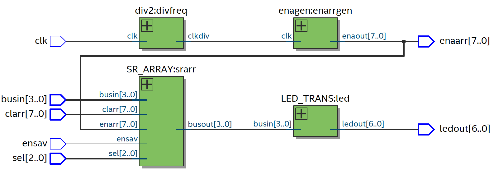

## Flow Summary
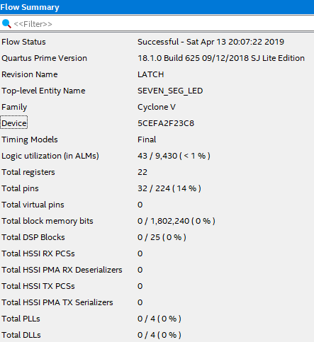

# 仿真结果
本程序提供三个程序的仿真，分别为SR锁存器、8路使能信号输出以及总工程。

## SR锁存器
```vhdl
library ieee;
use ieee.std_logic_1164.all;

entity SR_tb is
end entity SR_tb;

architecture rtl of SR_tb is
  component sr_latch
    generic(width: INTEGER:=4);
    port(
      latchIn: in std_logic_vector(width-1 downto 0);
      latchOut: out std_logic_vector(width-1 downto 0);
      ena: in std_logic;
      clr: in std_logic
    );
  end component;  

  signal latchIn: std_logic_vector(3 downto 0);
  signal latchOut: std_logic_vector(3 downto 0);
  signal ena: std_logic;
  signal clr: std_logic;

begin
  sr1: sr_latch generic map(4) port map(latchIn,latchOut,ena,clr);


  process
  begin
    clr <= '0';
    wait for 20 ns;
    clr <= '1';
    wait;
  end process;

  process
  begin
    latchIn <= "1011";
    ena <= '1';
    wait for 20 ns;
    ena <= '0';
    wait for 20 ns;
    latchIn <= "1100";
    ena <= '1';
    wait for 20 ns;
    ena <= '0';
  end process;
  
end architecture rtl;
```
本代码仅测试SR锁存器是否按照预期的输出，仿真结果如下:

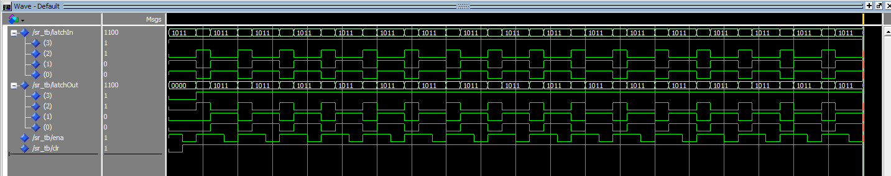

可见每当ena信号到来时输出均根据输入跳变，与预期一致。

## 8路使能信号输出
```vhdl
library ieee;
use ieee.std_logic_1164.all;

entity enagen_tb is
end enagen_tb;

architecture arch_enagen_tb of enagen_tb is
  component enagen is
    generic(num: integer:=8);
    port(
      clk: in std_logic;
      enaout: buffer std_logic_vector(num-1 downto 0)
    );
  end component;

  signal clk: std_logic;
  signal enaout: std_logic_vector(7 downto 0);
begin
  ena: enagen generic map(8) port map(clk, enaout);
  process
  begin
    clk <= '0';
    wait for 10 ns;
    clk <= '1';
    wait for 10 ns;
  end process;
end arch_enagen_tb;
```
本代码测试clk到来时使能阵列输出是否与预期一致。仿真结果如下:

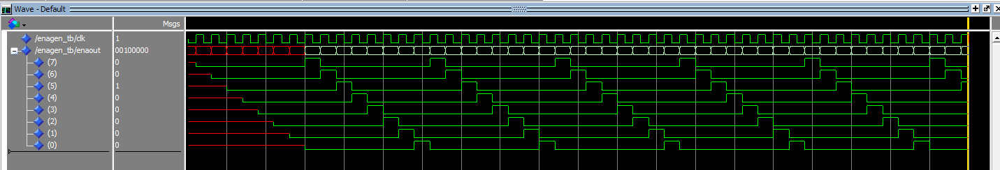

可见当第一个周期结束后所有ena均按预期输出，与预期一致。

## 总仿真
```vhdl
library ieee;
use ieee.std_logic_1164.all;

entity SEVEN_SEG_LED_tb is
end entity SEVEN_SEG_LED_tb;

architecture rtl of SEVEN_SEG_LED_tb is
  component seven_seg_led is
    port (
      clk: in std_logic;
      clarr: in std_logic_vector(7 downto 0);
      enaarr: out std_logic_vector(7 downto 0);
      ensav: in std_logic;
      sel: in std_logic_vector(2 downto 0);
      busin: in std_logic_vector(3 downto 0);
      ledout: out std_logic_vector(6 downto 0)
    );
  end component;

  signal clk: std_logic;
  signal clarr: std_logic_vector(7 downto 0);
  signal enaarr: std_logic_vector(7 downto 0);
  signal ensav: std_logic;
  signal sel: std_logic_vector(2 downto 0);
  signal busin: std_logic_vector(3 downto 0);
  signal ledout: std_logic_vector(6 downto 0);

begin

  leds: seven_seg_led port map(clk, clarr, enaarr, ensav, sel, busin, ledout);

  clock: process
  begin
    clk <= '0';
    wait for 10 ns;
    clk <= '1';
    wait for 10 ns;
  end process clock;

  ensav <= '1';

  inputs: process
  begin
    sel <= "000";
    busin <= "1000";
    wait for 20 ns;
    sel <= "001";
    busin <= "0010";
    wait for 20 ns;
    sel <= "010";
    busin <= "0000";
    wait for 20 ns;
    sel <= "011";
    busin <= "1011";
    wait for 20 ns;
    sel <= "100";
    busin <= "1111";
    wait for 20 ns;
    sel <= "101";
    busin <= "0001";
    wait for 20 ns;
    sel <= "110";
    busin <= "0100";
    wait for 20 ns;
    sel <= "111";
    busin <= "0011";
    wait for 20 ns;
  end process inputs;
  
  process
  begin
  clarr <= "00000000";
  wait for 10 ns;
  clarr <= "11111111";
  wait;
  end process;
end architecture rtl;
```
本代码测试clk正确触发，且更改输入数据的情况下整体输出情况。仿真结果如下:

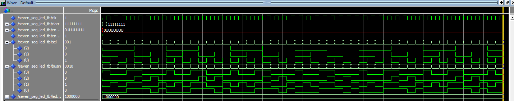

可见每当一个ena到达时均有个不同的数据按照预先定义好的方法输出，与预期一致。

# FPGA验证结果
## 引脚分配
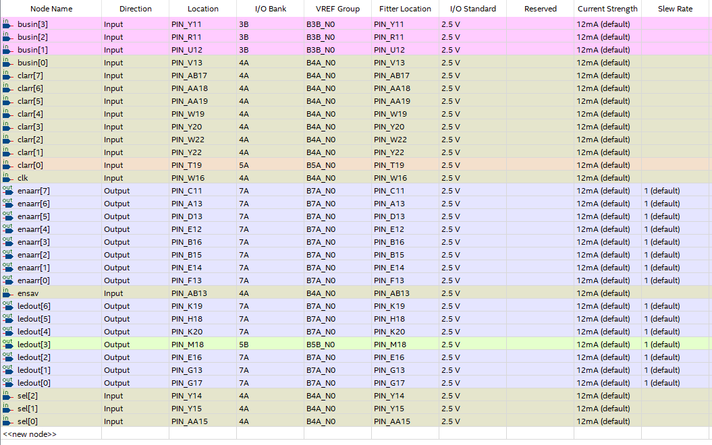

本实验引脚较多，但大多数引脚均只与特定的器件相连。可操控的引脚有锁存器选择3bits、输出使能1bit、数据输入4bits和重置引脚8bits，布置在DIP0到DIP15上。

## 实验结果
按照指定的方案重置引脚clr先置0，此时数码管均显示0。将所有clr脚均拨上去后控制sel锁存器选择引脚与数据引脚，当输出使能脚为高时指定的数码管显示数字与预期一致变化，而其他数码管显示数据不变。

# 实验总结
本次实验使用了上次实验中学到的调试方法较快地定位到了错误并修正，节省了很多时间。

同时本次实验中我尝试了采用移位寄存器与输入比较法进行8路使能信号的输出，发现在输出逻辑一致的情况下移位寄存器的实现方式使用的逻辑单元明显少于比较法所需的单元数，最终我在代码中采用了移位寄存器的实现方法。

$50MHz$时钟对应的时钟周期为$20\mu s$，在这种速率下门电路为成功完成其对应逻辑输出就改变了，带来的效果是一个数码管的变化会影响到其相邻数码管，最终通过添加分频器的方法解决了该问题。