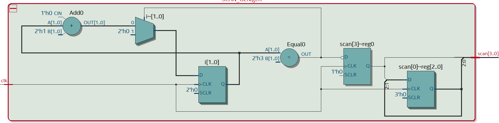
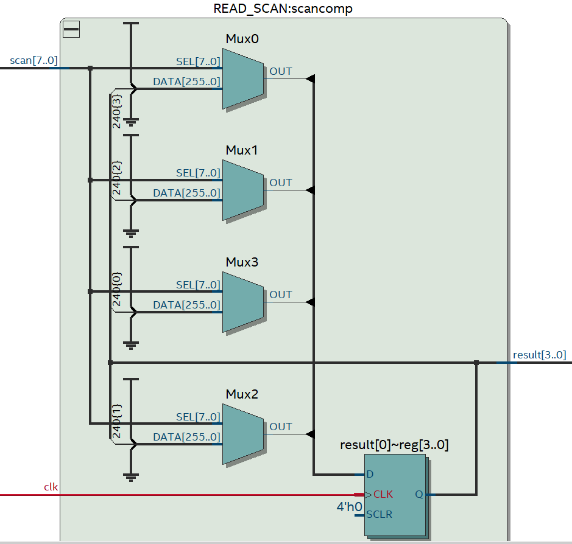
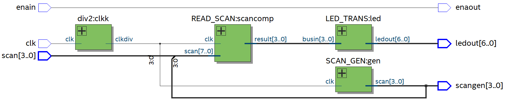
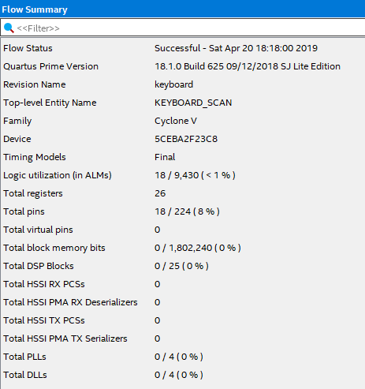
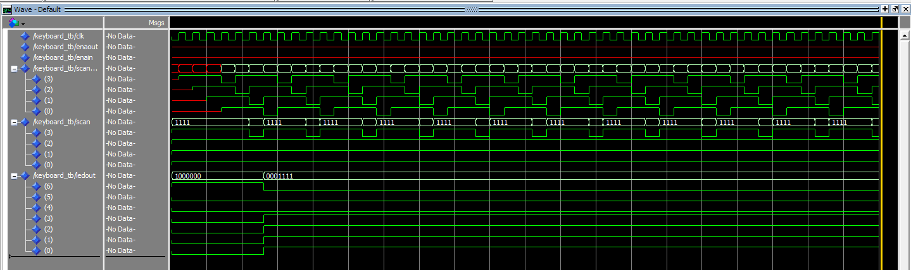
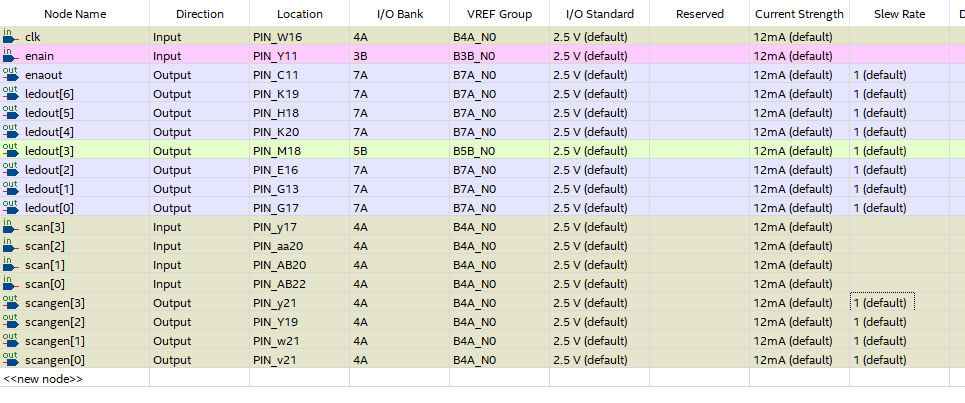

# 键盘阵列扫描输出实验报告 PB16061024 陈进泽

# 实验内容
1. 进一步学习并掌握Quartus II设计的方法及步骤
2. 熟悉VHDL语言电路设计方法
3. 熟悉VHDL test bench(测试平台/测试激励)的设计
4. 学习并掌握利用VHDL描述并设计电路的方法及步骤
5. 学习并掌握健盘阵列的扫描输入的方法及实验过程

# 设计分析
键盘扫描的原理是随时钟信号产生对应的行(列)扫描信号，再根据此时读取道德列(行)信息判断哪个键被按下，故可分为扫描信号发生器SCAN_GEN和列(行)信号读取器件READ_SCAN两个模块设计。

扫描信号发生器SCAN_GEN根据clk信号按序输出对应的行(列)扫描信号。

列(行)信号读取器READ_SCAN根据行(列)的扫描信号以及列(行)读取的信号状态输出按键译码结果。由于译码时需要知道扫描信号，为了简便起见我把行(列)扫描信号与列(行)状态信息串联为一个长度为8的信号矢量，而整个元件简化为了一个8-4译码器。

为了在实验板上展现结果本实验复用了第三次实验的七段数码管译码电路LED_TRANS和分频器DIV2，并将所有的器件集合在了KEYBOARD_SCAN中。

# 源代码
## 扫描信号发生器
```vhdl
library ieee;
use ieee.std_logic_1164.all;

entity SCAN_GEN is
  port (
    clk: in std_logic;
    scan: buffer std_logic_vector(3 downto 0)
  );
end entity SCAN_GEN;

architecture rtl of SCAN_GEN is
begin
  process(clk)
    variable i: integer range 0 to 3 := 0;
    begin
      if(clk'event and clk='1') then
        scan(2 downto 0) <= scan(3 downto 1);
        if(i = 3) then
          i := 0;
          scan(3) <= '0';
        else
          i := i+1;
          scan(3) <= '1';
        end if;
      end if;
  end process;
end architecture rtl;
```
本电路复用了实验三8路使能信号输出电路的代码，采用移位寄存器来实现扫描信号的输出，使用逻辑单元数小于采用计数器的实现方式。电路见下图：



## 列(行)信号读取
```vhdl
library ieee;
use ieee.std_logic_1164.all;

entity READ_SCAN is
  port (
    clk: in std_logic;
    scan: in std_logic_vector(7 downto 0);
    result: out std_logic_vector(3 downto 0)
  );
end entity READ_SCAN;

architecture rtl of READ_SCAN is
begin
  process(clk,scan)
  begin
    if(clk'event and clk='1') then
      case scan is
        when "11101110" => result <= "1101";
        when "11101101" => result <= "1111";
        when "11101011" => result <= "0000";
        when "11100111" => result <= "1110";
        when "11011110" => result <= "1100";
        when "11011101" => result <= "1001";
        when "11011011" => result <= "1000";
        when "11010111" => result <= "0111";
        when "10111110" => result <= "1011";
        when "10111101" => result <= "0110";
        when "10111011" => result <= "0101";
        when "10110111" => result <= "0100";
        when "01111110" => result <= "1010";
        when "01111101" => result <= "0011";
        when "01111011" => result <= "0010";
        when "01110111" => result <= "0001";
        when others => null;
      end case;
    end if;
  end process;
end architecture rtl;
```
本电路通过在逻辑上分离了扫描信号和状态信号使得电路整体的逻辑简化为了一个8-4译码器。clk信号的使用是为了预防按键抖动。电路见下图：



## 整体结构
```vhdl
library ieee;
use ieee.std_logic_1164.all;

entity KEYBOARD_SCAN is
  port (
    clk: in std_logic;
    enaout: out std_logic;
    enain: in std_logic;
    scangen: buffer std_logic_vector(3 downto 0);
    scan: in std_logic_vector(3 downto 0);
    ledout: out std_logic_vector(6 downto 0)
  );
end entity KEYBOARD_SCAN;

architecture rtl of KEYBOARD_SCAN is
  component LED_TRANS is
    port (
      busin: in std_logic_vector(3 downto 0);
      ledout: out std_logic_vector(6 downto 0)
    );
  end component;

  component READ_SCAN is
    port (
	   clk: in std_logic;
      scan: in std_logic_vector(7 downto 0);
      result: out std_logic_vector(3 downto 0)
    );
  end component;

  component SCAN_GEN is
    port (
      clk: in std_logic;
      scan: buffer std_logic_vector(3 downto 0)
    );
  end component;
  
component div2 is
  port(
    clk: in std_logic;
    clkdiv: out std_logic
  );
end component;  
  signal result: std_logic_vector(3 downto 0);
  signal scann: std_logic_vector(7 downto 0);
  signal clkdiv: std_logic;
begin
  scann <= scangen & scan;
  clkk: div2 port map(clk, clkdiv);
  gen: SCAN_GEN port map(clkdiv, scangen);
  scancomp: READ_SCAN port map(clkdiv, scann, result);
  led: LED_TRANS port map(result, ledout);
  enaout <= enain;
  
end architecture rtl;
```
本电路在内部将扫描信号与读取状态连接在一起输入到READ_SCAN处，将clk分频以及把输出接到数码管译码器上，实现了所有结构的互联。enain与enaout目的为将拨码开关与数码管阳极直接相连。电路见下图：



## Flow Summary


# 仿真结果
由于此电路较简单，本实验只提供了整体结构的仿真，其中clk并未接分频器。
```vhdl
library ieee;
use ieee.std_logic_1164.all;

entity KEYBOARD_tb is
end entity KEYBOARD_tb;

architecture rtl of KEYBOARD_tb is
  component KEYBOARD_SCAN is
    port (
      clk: in std_logic;
      enaout: out std_logic;
      enain: in std_logic;
      scangen: buffer std_logic_vector(3 downto 0);
      scan: in std_logic_vector(3 downto 0);
      ledout: out std_logic_vector(6 downto 0)
    );
  end component;

  signal clk:  std_logic;
  signal enaout:  std_logic;
  signal enain:  std_logic;
  signal scangen:  std_logic_vector(3 downto 0);
  signal scan:  std_logic_vector(3 downto 0);
  signal ledout:  std_logic_vector(6 downto 0);
begin
  key: KEYBOARD_SCAN port map(clk,enaout,enain,scangen,scan,ledout);

  clock: process
  begin
    clk <= '0';
    wait for 10 ns;
    clk <= '1';
    wait for 10 ns;
  end process clock;

  keyboard: process(scangen)
  begin
    case scangen is
      when "1101" => scan <= "0111";
      when others => scan <= "1111";
    end case;
  end process keyboard;
end architecture rtl;
```
本仿真目的就是模仿当仅有一个键按下时整个电路的变化情况。仿真结果如下：



当按键7被按下时LED显示为7，与预期一致

# FPGA验证结果
## 引脚分配


## 实验结果
按下某一键后数码管会显示对应数字，且即使快速按某一键也不会出现显示数组抖动情况。

# 实验总结
本次实验较简单，但因为一些小的问题(没有全编译就烧写程序)从而出现了找不出错误的情况。关于这点一方面以后操作的时候应该更细心，另一方面Quartus软件在编译完成前就有输出文件很有迷惑性，如果能有对应提示无疑会更好。