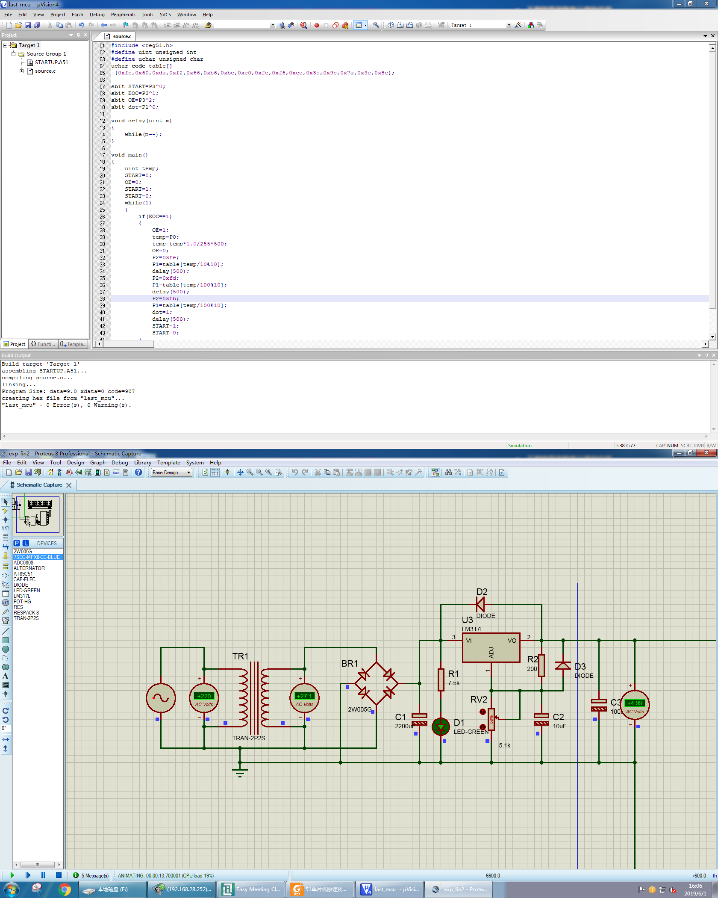
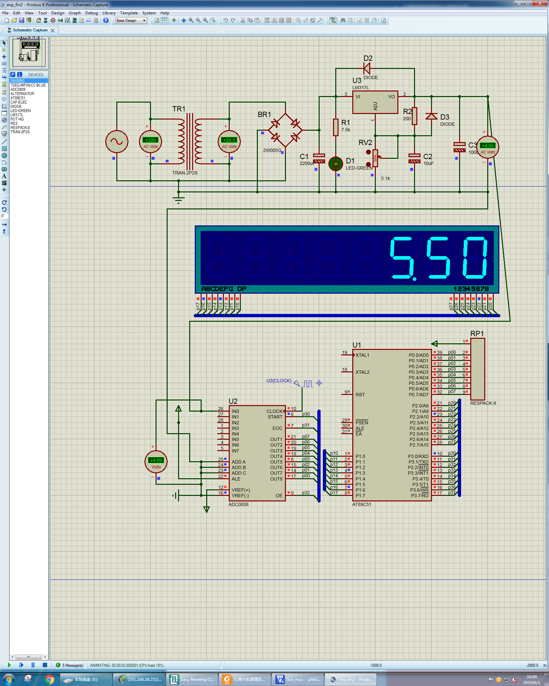

# 实验名称：基于Proteus与AT89C51的数显直流稳压电源与电压表设计实验

# 实验内容
## 数显直流稳压电源设计
### 实验流程
1. 打开Proteus软件，新建工程，配置选择默认值。
2. 在元器件库查找对应原件加入库中。
3. 根据集成稳压电路原理图连接元件并配置元件参数。
4. 进行仿真观察实验结果是否与预期一致。

### 搭建电路结果与仿真


## 基于AT89C51的直流电压表设计
### 实验流程
1. 创建Proteus工程并搭建电路。
2. 创建Keil工程，选择型号为AT89C51，键入代码并编译生成hex文件。
3. 在Proteus工程中添加Keil生成的hex代码到AT89C51中。
4. 仿真

### Keil代码
```c
#include <reg51.h>
#define uint unsigned int
#define uchar unsigned char
uchar code table[]
={0xfc,0x60,0xda,0xf2,0x66,0xb6,0xbe,0xe0,0xfe,0xf6,0xee,0x3e,0x9c,0x7a,0x9e,0x8e};

sbit START=P3^0;
sbit EOC=P3^1;
sbit OE=P3^2;
sbit dot=P1^0;

void delay(uint m)
{
  while(m--);
}

void main()
{
  uint temp;
  START=0;
  OE=0;
  START=1;
  START=0;
  while(1)
  {
    if(EOC==1)
    {
      OE=1;
      temp=P0;
      temp=temp*1.0/255*500;
      OE=0;
      P2=0xfe;
      P1=table[temp/10%10];
      delay(500);
      P2=0xfd;
      P1=table[temp/100%10];
      delay(500);
      P2=0xfb;
      P1=table[temp/100%10];
      dot=1;
      delay(500);
      START=1;
      START=0;
    }      
  }
}
```
实验代码与例程一致，这里不做解释。

### 电路与仿真结果


在该电路中，51单片机通过ADC通道正确地读取到了直流稳压电源的输出电压，并将其显示在数码管上，证明两者均运行正常。

# Proteus使用体会
Proteus是一个可用于电路仿真的EDA工具，其包含了很多常用的元器件，并可观察电路建立的动态效果，可以用来观察电路初始建立过程。

除了电路仿真功能，Proteus最令我惊讶的是单片机的仿真功能，并可以动态加载Keil生成的hex文件或者进行远程debug，十分方便。在正常的单片机开发过程中，大多数时候都是只有将代码烧写进去之后才能得知代码是否正确，但使用如Proteus这种工具的话便可以在实际搭建电路之前先模拟代码，验证实际功能，并可通过交付设计图方便实际电路的搭建。

但是在实际使用过程中Proteus十分不稳定，如果之前的工作没有保存的话就遭殃了，这可能是软件版本安装的问题。

# 实验体会
在这三次实验中我们学习了Proteus这个EDA工具的使用。在之前的实验中我们使用的EDA工具只用于系统与RTL仿真，而Proteus实验正好补充了我们对电路仿真的认识，并实际尝试了它与Keil这种编程工具的联合工作。在这之前我一直都认为电路仿真的用途不大，通过这几次的实验我觉得电路仿真工具也是有它独特的地方和应用场景的。