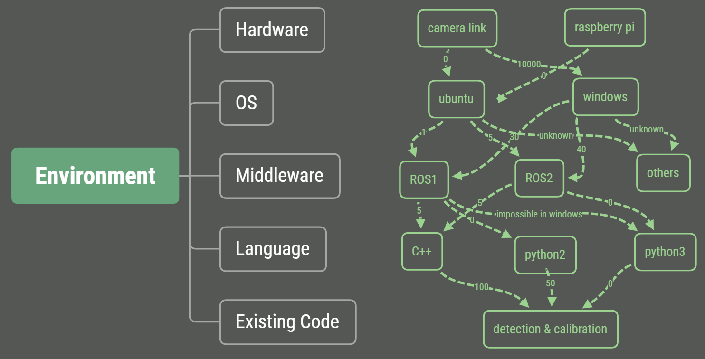

# Environment Configuration in Project **Starwar**

Author: Jinze Chen  
Date: 7/14/2019  
version: 0.0.1  

This report is mainly about the environment configuration and instructions about the usage of already deployed environment.

# Part 1: Overview
## Hardware and software requirements specification
The purpose of this project is to build a robust yet scalable robot so that we can conduct some promising research like robot localization, AI based approach for control tasks and so on.

In stage 1, we are using 3 cameras to locate the robot and then apply some control algorithms to navigate the robot to its destination. The hardware we are using are 3 cameras, 1 rapberry pi, 1 Arduino Uno and 1 dev-box with 4 Titan Xp.

For scalability and fast development, I decided to use ROS (Robot Operating System) as the middleware to operate on. There are 2 distributions called ROS1 and ROS2. Details can be found on https://en.wikipedia.org/wiki/Robot_Operating_System.

View based localization method is not part of my work currently, but I also built a docker environment for them to train their neural networks. The instructions to train a model on our dev-box is explained in Part 2.

The dependencies about the hardware, OS, middleware, programming environment and code can be shown as a graph listed below. The number represents the difficulty for deployment in my opinion. We need to find a path from top to bottom with least cost.



There are something to note though:
* The manufacturer doesn't provide driver for camlink on linux, and it doesn't work with default driver.
* ROS1 has more packages but doesn't support python3 officially. The build tool in python3 is based on linux specific libraries so it doesn't work on windows.
* ROS2 has support for low latency communication, but is unstable yet.
* ROS1 can communicate with ROS2 in C++.
* It's possible for C++ to call python modules. I have tested on simple scripts but it may cause trouble if it becomes big.
* Different language can communicate with each other with no problem in ROS. Members of the ROS 2 community have also created additional client libraries like C# and Node.js to build ros2 packages. Details can be found in https://index.ros.org//doc/ros2/Concepts/ROS-2-Client-Libraries/.

**The current plan for the environment is camlink+windows-desktop+ROS2-dashing+python3+algorithm communicate with pi+ubuntu-mate1804+ROS2-dashing**

## Something about pyrobot https://pyrobot.org/
In my opinion, the ambition of pyrobot is to share their algorithms and networks between researchers with the prerequisite that they use the same robot. So it's of no use in the early stage of our project. Pyrobot is also based on ROS1, so we can implement the interface in the future. And I failed to build the pyrobot environment.

## Some useful links about reinforcement learning frameworks in robotics
https://github.com/AcutronicRobotics/ros2learn

# Part 2: Instructions to use dev-box to train your model
## A brief introduction to docker
You can treat docker as a lightweight virtual machine. I use docker to provide better isolation and resource management for training. It's also possible to use docker to build a cloud server in the future. Here I only describe the development environment in our dev-box. Here is the tutorial I used to learn docker http://www.runoob.com/docker/docker-tutorial.html.

## How to build a docker server
1. Install docker
2. Install gpu driver
3. Install nvidia-docker for gpu support (ubuntu only, because windows version doesn't support gpu)
4. Create your own images
5. Use it

\* Administrators shouldn't let users use docker commands directly for security concerns. Instead, administrators should provide a script with right privileges for them to use.

## Some useful docker commands
`docker images #list installed images`  
`docker ps -a #list all containers (including stopped ones)`  
`docker rm -f <container_id> #force the removal of certain container`  
```
docker run
            --rm #remove container automatically after it exits
             -it #connect the container to the terminal
--runtime=nvidia #enable the use of gpu
-e NVIDIA_VISIBLE_DEVICES=0,1 #only allow usage of gpu0 and gpu1
      --cpus=1.5 #limit available cpu resources
      --name web #name the container
      -p 5000:80 #expose port 5000 externally and map to port 80
  -v ~/dev:/code #create a host mapped volume inside the container
      alpin3:3.4 #the image from which the container is instantiated
         /bin/sh #the command to run inside the container
```

More can be found in https://docs.docker.com/get-started/.

## Existing images in dev-box
> $ docker images  
> starwar                 pytorch0.4.1-cuda9.2-cudnn7-ubuntu1604-opencv4.1-sshd        aee7e2fe8506        8 days ago          3.28GB  
> ros-kinetic-cuda        full                                                         90a6d9aa2c8c        9 days ago          4.54GB  
> starwar-ros2            cuda10.1-cudnn7-ubuntu18.04-anaconda3-pytorch1.1-opencv4.1   01167b982f8c        9 days ago          4.26GB  
> starwar-ros2            latest                                                       01167b982f8c        9 days ago          4.26GB  
> starwar                 pytorch0.4.1-cuda9.2-cudnn7-ubuntu1604-opencv4.1             bb1fd4e913b5        9 days ago          3.23GB  
> ros-kinetic-cuda        latest                                                       b304d84d4606        9 days ago          2.1GB  
> osrf/ros2               nightly                                                      6d95d76bcdcb        9 days ago          3.53GB  
> starwar                 latest                                                       84a4f835a255        9 days ago          7.94GB  
> cuda10.2-anaconda3      latest                                                       535ba039b4e9        10 days ago         6.24GB  
> nvidia/cuda             10.1-cudnn7-runtime-ubuntu18.04                              31f34f1664ab        12 days ago         1.59GB  
> nvidia/cuda             9.2-cudnn7-runtime-ubuntu16.04                               aac1a925b48a        12 days ago         1.3GB  
> nvidia/cuda             latest                                                       010a71dc59db        12 days ago         2.81GB  
> ros                     kinetic-ros-base-xenial                                      7d6ef5f3e9b5        3 weeks ago         1.19GB  
> continuumio/anaconda3   latest                                                       cb34e4508fdc        7 weeks ago         3.72GB  
> hello-world             latest                                                       fce289e99eb9        6 months ago        1.84kB  
> pytorch/pytorch         0.4.1-cuda9-cudnn7-runtime                                   7b329a33d981        11 months ago       2.91GB  

## How to build an image
Use a dockerfile or commit from containers (not recommended).

## Advanced usage of docker
### To connect pycharm from an extranet to a docker environment in dev-box (not recommended)
Use ssh forwarding capability to make it possible https://docs.docker.com/engine/examples/running_ssh_service/.

Example commands in dev-box: `docker run -d --name train_sshd --runtime=nvidia -p 2200:22 --rm -v /home/wuw:/home/wuw -e NVIDIA_VISIBLE_DEVICES=2,3 starwar:pytorch0.4.1-cuda9.2-cudnn7-ubuntu1604-opencv4.1-sshd`

And connect to it via `ssh -N -f -L 6000:127.0.0.1:2200 username@domain_name -o TCPKeepAlive=yes`. After that your local port 6000 is the same as server port 2200 so you can ssh to the docker now. `-N` means only do port forwarding, `-f` means run in the background, and `-L` means do local port mapping. Details can be found in https://www.ibm.com/developerworks/cn/linux/l-cn-sshforward/index.html.

# Part 3: ROS environment
## Features of ROS
1. Based on internet to communicate among different machines
2. Use publish-subscribe logic to exchange information between nodes, also support for service and actions (only in ROS2)
3. ROS2 may support embedded MCUs in the future
4. Many good algorithms and visualization tools has been built in ROS
5. Support for playback so we can change the parameters offline
## Installation
It's hard to build ros in a virtual environment. If you are installing ROS2 on windows, you'd better prepare a freshly installed one, or the python environment configuration can make you crazy.
### On ubuntu
https://index.ros.org/doc/ros2/Installation/
### On windows
I failed to build ROS2 from source on windows. The prebuilt one also has some problems about the default FastRTPS implementation. I used openslice as the DDS implementation and it works.

## Programming guild on ROS2
Coming soon...