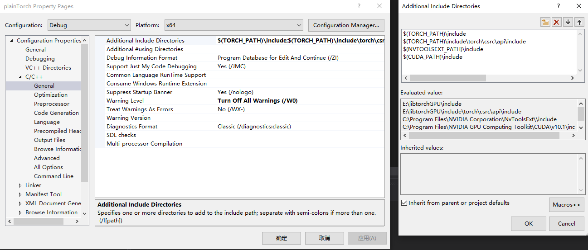
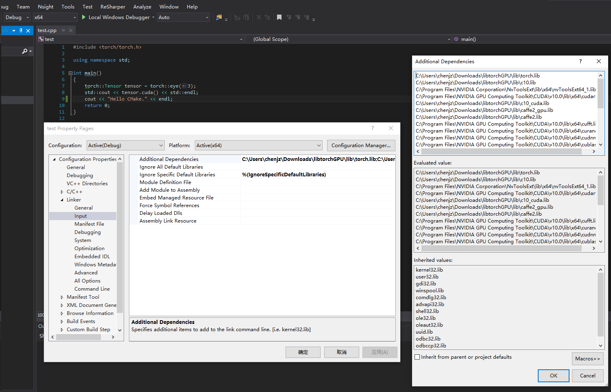
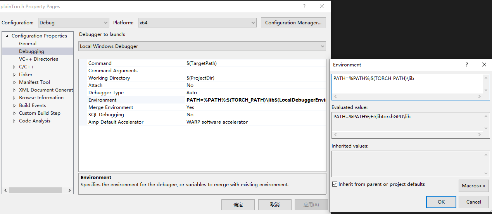
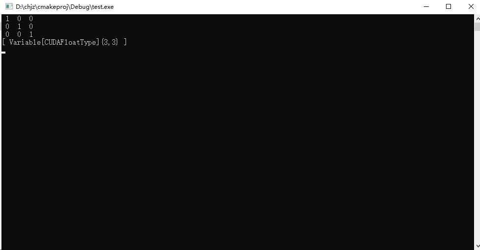

# Visual Studio libtorch使用教程

## 预备软件
- **libtorch**: cpu或gpu版本均可, 根据本机环境选择, 但要注意下载nightly build版, 因stable版头文件引用有错误。
- **visual studio**: 本教程在vs2015与2019版本下均调试通过, 根据本机环境选择。
- ***cmake**: 可选, 当教程中其他方法均失败情况下尝试。

## 使用流程
1. 下载对应版本libtorch并解压到对应目录, 如在本机为`C:\Users\chenjz\Downloads\libtorchGPU`。
2. 打开visual studio创建新项目, 添加源代码`test.cpp`
```cpp
#include <iostream>
#include <torch/torch.h>

using namespace std;

int main()
{
	torch::Tensor tensor = torch::eye(3);
	std::cout << tensor.cuda() << std::endl;
	return 0;
}
```
3. 右键项目属性, 总共有三项需要配置: 
 
  
```
C:\Users\chenjz\Downloads\libtorchGPU\include;C:\Users\chenjz\Downloads\libtorchGPU\include\torch\csrc\api\include;C:\Program Files\NVIDIA Corporation\NvToolsExt\include;C:\Program Files\NVIDIA GPU Computing Toolkit\CUDA\v10.0\include;%(AdditionalIncludeDirectories)
```
  
```
C:\Users\chenjz\Downloads\libtorchGPU\lib\torch.lib
C:\Users\chenjz\Downloads\libtorchGPU\lib\c10.lib
C:\Program Files\NVIDIA Corporation\NvToolsExt\lib\x64\nvToolsExt64_1.lib
C:\Program Files\NVIDIA GPU Computing Toolkit\CUDA\v10.0\lib\x64\cudart.lib
C:\Users\chenjz\Downloads\libtorchGPU\lib\c10_cuda.lib
C:\Users\chenjz\Downloads\libtorchGPU\lib\caffe2_gpu.lib
C:\Users\chenjz\Downloads\libtorchGPU\lib\caffe2.lib
C:\Program Files\NVIDIA GPU Computing Toolkit\CUDA\v10.0\lib\x64\cufft.lib
C:\Program Files\NVIDIA GPU Computing Toolkit\CUDA\v10.0\lib\x64\curand.lib
C:\Program Files\NVIDIA GPU Computing Toolkit\CUDA\v10.0\lib\x64\cudnn.lib
C:\Program Files\NVIDIA GPU Computing Toolkit\CUDA\v10.0\lib\x64\cublas.lib
```
  
```
PATH=%PATH%;C:\Users\chenjz\Downloads\libtorchGPU\lib
```

配置1设置引用目录, 配置2设置引用静态库, 配置3设置dll引用路径, 若使用的是cpu版本可以将配置中有关cuda的部分全部删除。

4. 编译并链接程序: 有人build项目时可能会报错C4996, 这是msvc为了安全所引用的特性, 可以在`项目配置->C/C++->Advanced->Disable Specific Warnings`里添加4996。

*在已有项目里添加libtorch同样需要以上三步。

## 运行成功!


# 在上述方法失效的情况下从cmake重新创建工程
以上方法依赖于libtorch现有的项目结构, 故可能不适用于未来版本。在这种时候需要从cmake项目开始重新生成sln项目。

## 检查cmake版本与功能
输入命令`cmake -h`, 检查generator选项, 样例输出如下图


## 手动编写CMakeLists.txt文件, 示例如下
```cmake
cmake_minimum_required (VERSION 3.8)

set(CMAKE_CXX_STANDARD 11)

find_package(Torch REQUIRED)

add_executable (CMakeProject "CMakeProject.cpp" "CMakeProject.h")

target_link_libraries(CMakeProject ${TORCH_LIBRARIES})
```

## 使用cmake自带的generator生成vs项目, 以vs2015为例
`cmake -DCMAKE_PREFIX_PATH=C:\Users\chenjz\Downloads\libtorchGPU -DCMAKE_BUILD_TYPE=Debug -G"Visual Studio 14 2015 Win 64" .`

若上述操作无误项目文件夹应该如下图, `Project.sln`为生成项目。


## 项目说明
`Project.sln`共包含三个项目: **ALL_BUILD**, **CMakeProject**, **ZERO_CHECK**, 其中CMakeProject是我们想要的。


**CMakeProject**下的**External Dependencies**里包含了所有与libtorch有关的头文件, 配置好dll路径后若无错误就可以直接编译运行了。

# 在HM中调用代码
我在github上提供了一个HM16.20的cmake项目, 大家可以在对应位置修改CMakeLists.txt来在指定项目调用libtorch。

- 在C++中加载pytorch模型教程[https://pytorch.org/tutorials/advanced/cpp_export.html](https://pytorch.org/tutorials/advanced/cpp_export.html)
- HM cmake工程[https://github.com/chjz1024/HM_vc2015](https://github.com/chjz1024/HM_vc2015)