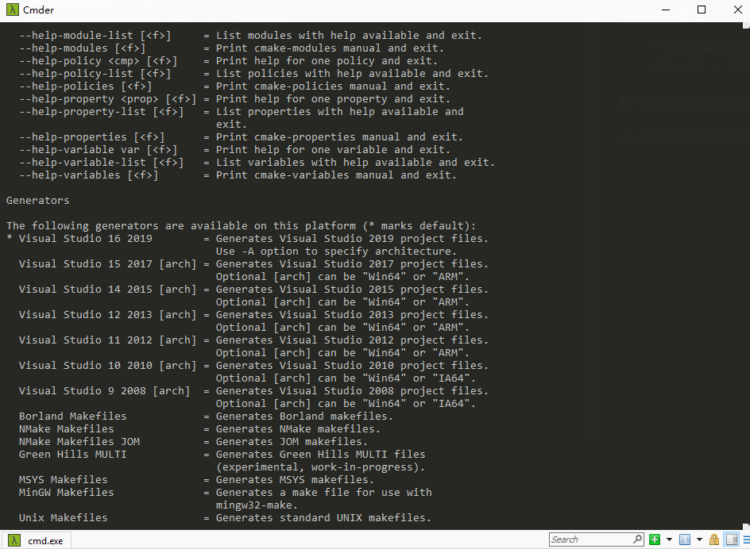
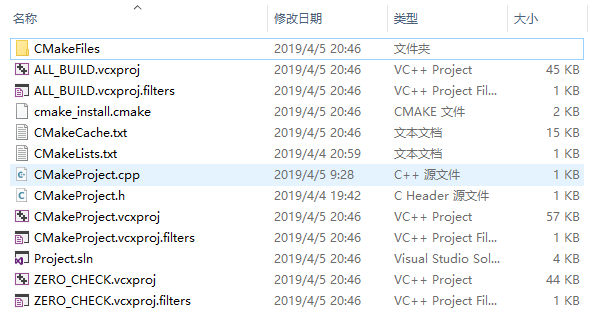
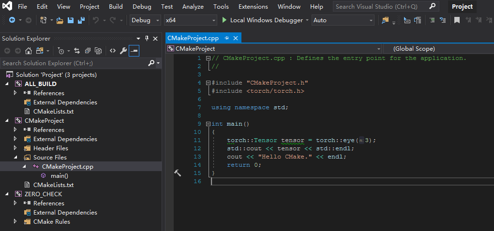
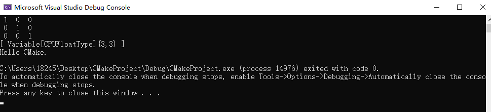

# Visual Studio libtorch使用教程

## 预备软件
- **libtorch**: 下载windows下libtorch的nightly build, stable版本头文件引用有问题, 推荐下载cpu版本, 因为gpu版本环境配置比较复杂
- **visual studio**: 本教程使用的是vs2019, 但其他版本使用方法应没有太大差别
- **cmake**: vs2015不自带cmake工具, 需要自行去官网下载, 下载好加入系统PATH

## libtorch准备
- 下载完成后解压到对应目录, 如`C:\libtorch`
- 添加`<libtorch下载目录>\lib`至系统PATH

## 检查cmake版本及功能
cmake安装完成后输入命令`cmake -h`, 检查generator选项, 样例输出如下图

## 项目准备
若已安装vs2017及以上版本可以直接创建cmake项目, 若没有则手动编写`CMakeLists.txt`文件, 示例文件如下

> cmake_minimum_required (VERSION 3.8)
> 
> set(CMAKE_CXX_STANDARD 11)
> 
> find_package(Torch REQUIRED)
> 
> add_executable (CMakeProject "CMakeProject.cpp" "CMakeProject.h")
> 
> target_link_libraries(CMakeProject ${TORCH_LIBRARIES})
> 
> target_include_directories(CMakeProject PUBLIC TORCH_INCLUDE_DIRS)

进入项目目录, 执行命令`cmake -DCMAKE_PREFIX_PATH=<libtorch下载目录> -DCMAKE_BUILD_TYPE=Debug|Release -G"<项目类型>" .`

如对于libtorch安装在`C:\libtorch`目录下, 要生成vs2019项目, 项目类型为Debug的情况执行`cmake -DCMAKE_PREFIX_PATH=E:\libtorch -DCMAKE_BUILD_TYPE=Debug -G"Visual Studio 16 2019" .`

若上述操作无误项目文件夹应该如下图, `Project.sln`为生成项目

## 项目说明
`Project.sln`共包含三个项目: **ALL_BUILD**, **CMakeProject**, **ZERO_CHECK**, 其中CMakeProject是我们想要的

**CMakeProject**下的**External Dependencies**里包含了所有与libtorch有关的头文件, 若无错误就可以直接编译运行了

运行成功!

# 在HM中调用代码
由于现阶段libtorch调用必须通过cmake执行, 我在github上提供了一个HM16.20的cmake项目, 大家可以在对应位置修改CMakeLists.txt来在指定项目调用libtorch

- 在C++中加载pytorch模型教程[https://pytorch.org/tutorials/advanced/cpp_export.html](https://pytorch.org/tutorials/advanced/cpp_export.html)
- HM cmake工程[https://github.com/chjz1024/HM_vc2015](https://github.com/chjz1024/HM_vc2015)