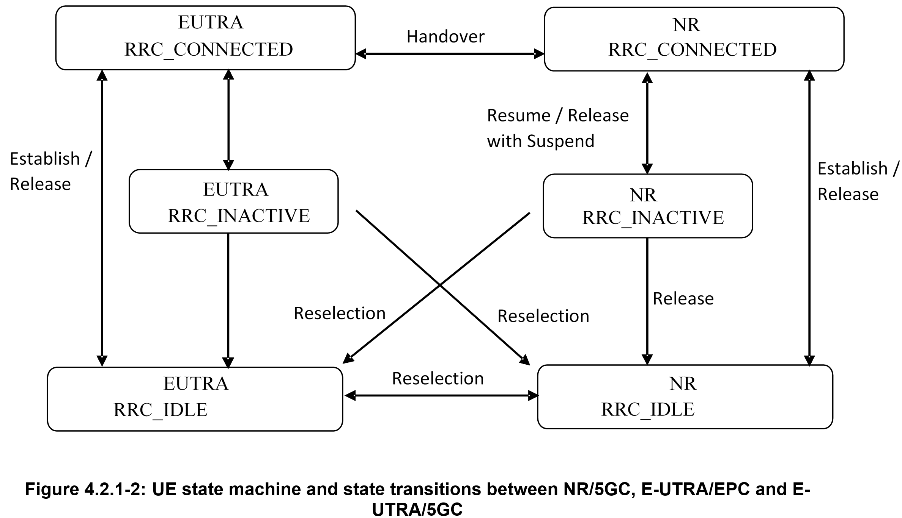

# 控制层协议栈

# 7.1 Services and Functions
-	Broadcast of System Information related to AS and NAS;
-	Paging initiated by 5GC or NG-RAN;
-	**Establishment, maintenance and release of an RRC connection between the UE and NG-RAN including:**
    -	Addition, modification and release of carrier aggregation;
    -	Addition, modification and release of Dual Connectivity in NR or between E-UTRA and NR.
-	Security functions including key management;
-	Establishment, configuration, maintenance and release of Signalling Radio Bearers (SRBs) and Data Radio Bearers (DRBs);
- **Mobility functions including:**
    -	Handover and context transfer;
    -	UE cell selection and reselection and control of cell selection and reselection;
    -	Inter-RAT mobility.
-	QoS management functions;
-	UE measurement reporting and control of the reporting;
-	Detection of and recovery from radio link failure;
-	NAS message transfer to/from NAS from/to UE.

# 7.2 Protocol States
-	RRC_IDLE:
    -	PLMN selection;
    -	Broadcast of system information;
    -	Cell re-selection mobility;
    -	Paging for mobile terminated data is    initiated by 5GC;
    -	DRX for CN paging configured by NAS.
-	RRC_INACTIVE:
    -	PLMN selection;
    -	Broadcast of system information;
    -	Cell re-selection mobility;
    -	Paging is initiated by NG-RAN (RAN paging);
    -	RAN-based notification area (RNA) is managed by NG- RAN;
    -	DRX for RAN paging configured by NG-RAN;
    -	5GC - NG-RAN connection (both C/U-planes) is established for UE;
    -	The UE AS context is stored in NG-RAN and the UE;
    -	NG-RAN knows the RNA which the UE belongs to.
-	RRC_CONNECTED:
    -	5GC - NG-RAN connection (both C/U-planes) is established for UE;
    -	The UE AS context is stored in NG-RAN and the UE;
    -	NG-RAN knows the cell which the UE belongs to;
    -	Transfer of unicast data to/from the UE;
    -	Network controlled mobility including measurements.

# 7.3.1 System Information(SI)
System Information (SI) consists of a MIB and a number of SIBs, which are divided into Minimum SI and Other SI:
-	Minimum SI comprises basic information required for initial access and information for acquiring any other SI. Minimum SI consists of:
    -	MIB contains cell barred status information and essential physical layer information of the cell required to receive further system information, e.g. CORESET#0 configuration. MIB is periodically broadcast on BCH.
    -	SIB1 defines the scheduling of other system information blocks and contains information required for initial access. SIB1 is also referred to as Remaining Minimum SI (RMSI) and is periodically broadcast on DL-SCH or sent in a dedicated manner on DL-SCH to UEs in RRC_CONNECTED.
-	Other SI encompasses all SIBs not broadcast in the Minimum SI. Those SIBs can either be periodically broadcast on DL-SCH, broadcast on-demand on DL-SCH (i.e. upon request from UEs in RRC_IDLE or RRC_INACTIVE), or sent in a dedicated manner on DL-SCH to UEs in RRC_CONNECTED. Other SI consists of:
    -	SIB2 contains cell re-selection information, mainly related to the serving cell;
    -	SIB3 contains information about the serving frequency and intra-frequency neighbouring cells relevant for cell re-selection (including cell re-selection parameters common for a frequency as well as cell specific re-selection parameters);
    -	SIB4 contains information about other NR frequencies and inter-frequency neighbouring cells relevant for cell re-selection (including cell re-selection parameters common for a frequency as well as cell specific re-selection parameters);
    -	SIB5 contains information about E-UTRA frequencies and E-UTRA neighbouring cells relevant for cell re-selection (including cell re-selection parameters common for a frequency as well as cell specific re-selection parameters);
    -	SIB6 contains an ETWS primary notification;
    -	SIB7 contains an ETWS secondary notification;
    -	SIB8 contains a CMAS warning notification;
    -	SIB9 contains information related to GPS time and Coordinated Universal Time (UTC).

For a cell/frequency that is considered for camping by the UE, the UE is not required to acquire the contents of the minimum SI of that cell/frequency from another cell/frequency layer. This does not preclude the case that the UE applies stored SI from previously visited cell(s).

If the UE cannot determine the full contents of the minimum SI of a cell by receiving from that cell, the UE shall consider that cell as barred.

In case of BA, the UE only acquires SI on the active BWP.

# 7.3.2	Scheduling
The MIB is mapped on the BCCH and carried on BCH while all other SI messages are mapped on the BCCH, where they are dynamically carried on DL-SCH. The scheduling of SI messages part of Other SI is indicated by SIB1.

For UEs in RRC_IDLE and RRC_INACTIVE, a request for Other SI triggers a random access procedure (see subclause 9.2.6) where MSG3 includes the SI request message unless the requested SI is associated to a subset of the PRACH resources, in which case MSG1 is used for indication of the requested Other SI. When MSG1 is used, the minimum granularity of the request is one SI message (i.e. a set of SIBs), one RACH preamble and/or PRACH resource can be used to request multiple SI messages and the gNB acknowledges the request in MSG2. When MSG 3 is used, the gNB acknowledges the request in MSG4.

The Other SI may be broadcast at a configurable periodicity and for a certain duration. The Other SI may also be broadcast when it is requested by UE in RRC_IDLE/RRC_INACTIVE.

For a UE to be allowed to camp on a cell it must have acquired the contents of the Minimum SI from that cell. There may be cells in the system that do not broadcast the Minimum SI and where the UE therefore cannot camp.

# 7.3.3	SI Modification
Change of system information (other than for ETWS/CMAS, see subclause 16.4) only occurs at specific radio frames, i.e. the concept of a modification period is used. System information may be transmitted a number of times with the same content within a modification period, as defined by its scheduling. The modification period is configured by system information.

When the network changes (some of the) system information, it first notifies the UEs about this change, i.e. this may be done throughout a modification period. In the next modification period, the network transmits the updated system information. Upon receiving a change notification, the UE acquires the new system information from the start of the next modification period. The UE applies the previously acquired system information until the UE acquires the new system information.

# 7.4	Access Control
NG-RAN supports overload and access control functionality such as RACH back off, RRC Connection Reject, RRC Connection Release and UE based access barring mechanisms.

One unified access control framework as specified in TS 22.261 [19] applies to all UE states (RRC_IDLE, RRC_INACTIVE and RRC_CONNECTED) for NR. NG-RAN broadcasts barring control information associated with Access Categories and Access Identities (in case of network sharing, the barring control information can be set individually for each PLMN). The UE determines whether an access attempt is authorized based on the barring information broadcast for the selected PLMN, and the selected Access Category and Access Identity(ies) for the access attempt:

-	For NAS triggered requests, NAS determines the Access Category and Access Identity(ies);
-	For AS triggered requests, RRC determines the Access Category while NAS determines the Access Identity(ies).

The gNB handles access attempts with establishment causes "emergency", "mps-PriorityAccess" and "mcs-PriorityAccess" (i.e. Emergency calls, MPS, MCS subscribers) with high priority and responds with RRC Reject to these access attempts only in extreme network load conditions that may threaten the gNB stability. 

# 4.2	Architecture
## 4.2.1	UE states and state transitions including inter RAT
A UE is either in RRC_CONNECTED state or in RRC_INACTIVE state when an RRC connection has been established. If this is not the case, i.e. no RRC connection is established, the UE is in RRC_IDLE state. The RRC states can further be characterised as follows:

-	RRC_IDLE:
    -	A UE specific DRX may be configured by upper layers;
    -	UE controlled mobility based on network configuration;
    -	The UE:
        -	Monitors Short Messages transmitted with P-RNTI over DCI (see clause 6.5);
        -	Monitors a Paging channel for CN paging using 5G-S-TMSI;
        -	Performs neighbouring cell measurements and cell (re-)selection;
        -	Acquires system information and can send SI request (if configured).
-	RRC_INACTIVE:
    -	A UE specific DRX may be configured by upper layers or by RRC layer;
    -	UE controlled mobility based on network configuration;
    -	The UE stores the UE Inactive AS context;
    -	A RAN-based notification area is configured by RRC layer;
    -   The UE:
        -	Monitors Short Messages transmitted with P-RNTI over DCI (see clause 6.5);
        -	Monitors a Paging channel for CN paging using 5G-S-TMSI and RAN paging using fullI-RNTI;
        -	Performs neighbouring cell measurements and cell (re-)selection;
        -	Performs RAN-based notification area updates periodically and when moving outside the configured RAN-based notification area;
        -	Acquires system information and can send SI request (if configured).
-	RRC_CONNECTED:
    -	The UE stores the AS context;
    -	Transfer of unicast data to/from UE;
    -	At lower layers, the UE may be configured with a UE specific DRX;
    -	For UEs supporting CA, use of one or more SCells, aggregated with the SpCell, for increased bandwidth;
    -	For UEs supporting DC, use of one SCG, aggregated with the MCG, for increased bandwidth;
    -	Network controlled mobility within NR and to/from E-UTRA;
    -	The UE:
        -	Monitors Short Messages transmitted with P-RNTI over DCI (see clause 6.5), if configured;
        -	Monitors control channels associated with the shared data channel to determine if data is scheduled for it;
        -	Provides channel quality and feedback information;
        -	Performs neighbouring cell measurements and measurement reporting;
        -	Acquires system information.

# 4.2.2	Signalling radio bearers
"Signalling Radio Bearers" (SRBs) are defined as Radio Bearers (RBs) that are used only for the transmission of RRC and NAS messages. More specifically, the following SRBs are defined:
-	SRB0 is for RRC messages using the CCCH logical channel;
-   SRB1 is for RRC messages (which may include a piggybacked NAS message) as well as for NAS messages prior to the establishment of SRB2, all using DCCH logical channel;
-	SRB2 is for NAS messages, all using DCCH logical channel. SRB2 has a lower priority than SRB1 and may be configured by the network after AS security activation;
-	SRB3 is for specific RRC messages when UE is in EN-DC, all using DCCH logical channel.

In downlink piggybacking of NAS messages is used only for bearer establishment/modification/release. In uplink piggybacking of NAS message is used only for transferring the initial NAS message during connection setup and connection resume.

NOTE 1:	The NAS messages transferred via SRB2 are also contained in RRC messages, which however do not include any RRC protocol control information.

Once AS security is activated, all RRC messages on SRB1, SRB2 and SRB3, including those containing NAS messages, are integrity protected and ciphered by PDCP. NAS independently applies integrity protection and ciphering to the NAS messages, see TS 24.501 [23].

Editor's Note:	FFS which SRBs are used for NE-DC, NR-NR DC.

# 4.3	Services
## 4.3.1	Services provided to upper layers
The RRC protocol offers the following services to upper layers:
-	Broadcast of common control information;
-	Notification of UEs in RRC_IDLE, e.g. about a mobile terminating call;
-	Notification of UEs about ETWS and/or CMAS
-	Transfer of dedicated signalling.
## 4.3.2	Services expected from lower layers
In brief, the following are the main services that RRC expects from lower layers:
-	Integrity protection, ciphering and loss-less in-sequence delivery of information without duplication;

# 4.4	Functions
The RRC protocol includes the following main functions:
-	Broadcast of system information:
    -	Including NAS common information;
    -	Information applicable for UEs in RRC_IDLE and RRC_INACTIVE (e.g. cell (re-)selection parameters, neighbouring cell information) and information (also) applicable for UEs in RRC_CONNECTED (e.g. common channel configuration information);
    -	Including ETWS notification, CMAS notification.
-	RRC connection control:
    -	Paging;
    -	Establishment/modification/suspension/resumption/release of RRC connection, including e.g. assignment/modification of UE identity (C-RNTI, fullI-RNTI, etc.), establishment/modification/suspension/resumption/release of SRBs (except for SRB0);
    -	Access barring;
    -	Initial AS security activation, i.e. initial configuration of AS integrity protection (SRBs, DRBs) and AS ciphering (SRBs, DRBs);
    -	RRC connection mobility including e.g. intra-frequency and inter-frequency handover, associated AS security handling, i.e. key/algorithm change, specification of RRC context information transferred between network nodes;
    -	Establishment/modification/suspension/resumption/release of RBs carrying user data (DRBs);
    -	Radio configuration control including e.g. assignment/modification of ARQ configuration, HARQ configuration, DRX configuration;
    -	In case of DC, cell management including e.g. change of PSCell, addition/modification/release of SCG cell(s);
    -	In case of CA, cell management including e.g. addition/modification/release of SCell(s);
    -	QoS control including assignment/ modification of semi-persistent scheduling (SPS) configuration and configured grant configuration for DL and UL respectively, assignment/ modification of parameters for UL rate control in the UE, i.e. allocation of a priority and a prioritised bit rate (PBR) for each RB.
    -	Recovery from radio link failure.
-	Inter-RAT mobility including e.g. AS security activation, transfer of RRC context information;
-	Measurement configuration and reporting:
    -	Establishment/modification/release of measurement configuration (e.g. intra-frequency, inter-frequency and inter- RAT measurements);
    -	Setup and release of measurement gaps;
    -	Measurement reporting.
-	Other functions including e.g. generic protocol error handling, transfer of dedicated NAS information, transfer of UE radio access capability information.
