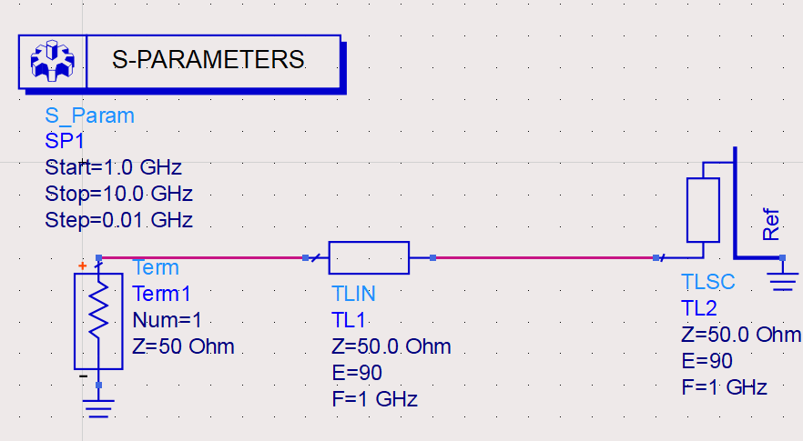
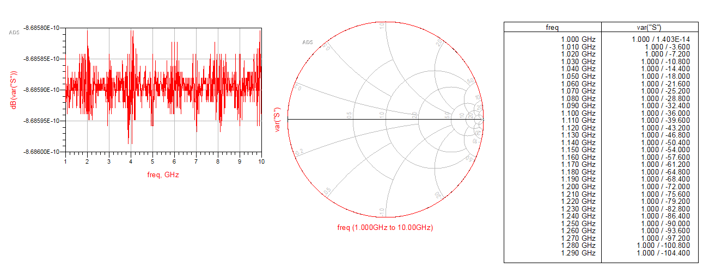
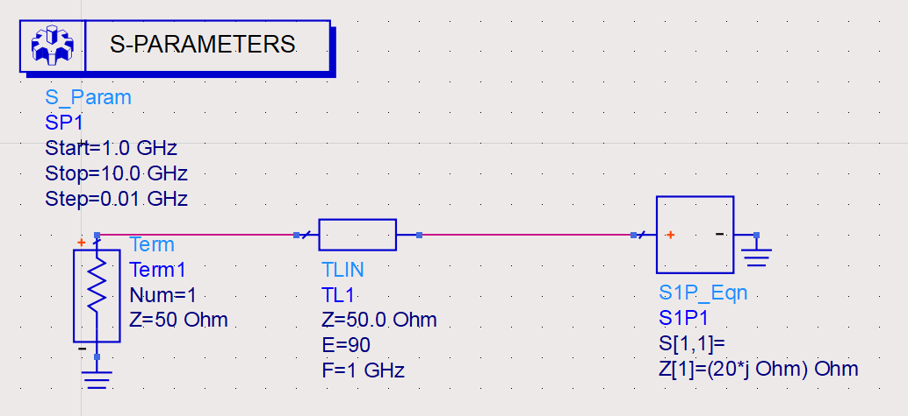
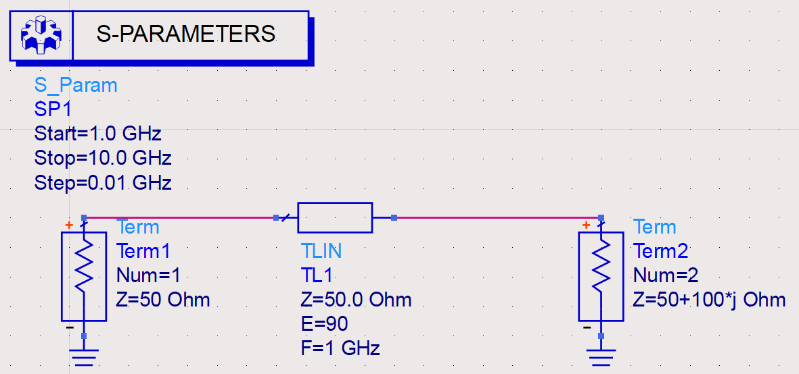
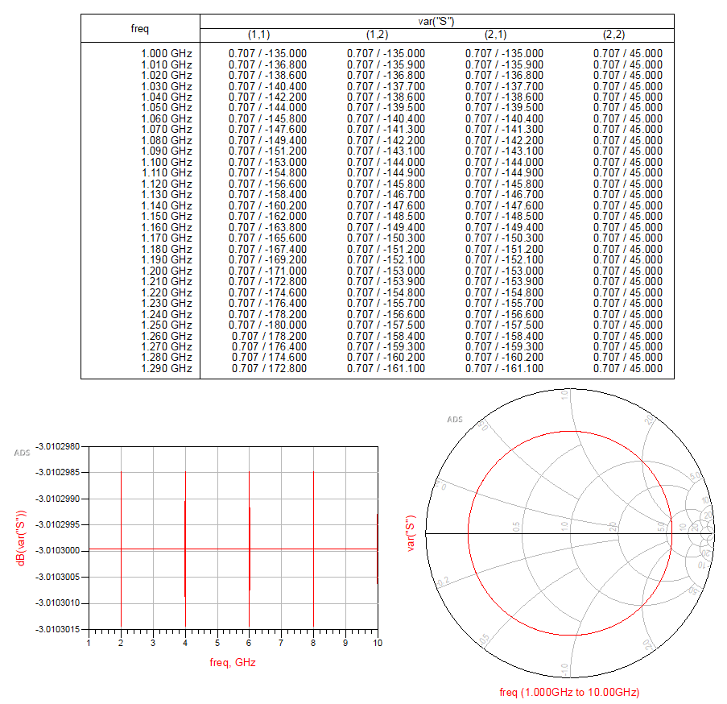
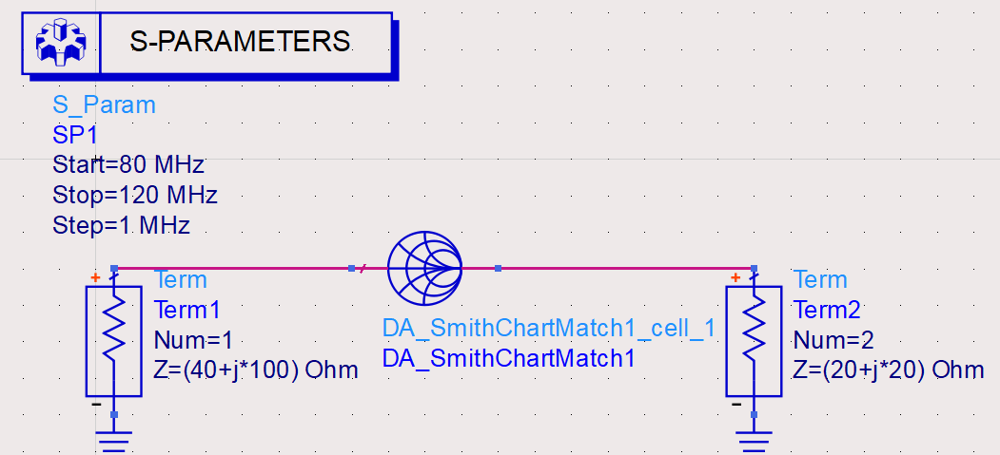
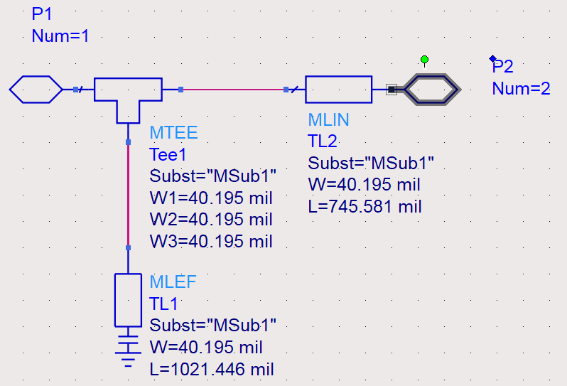
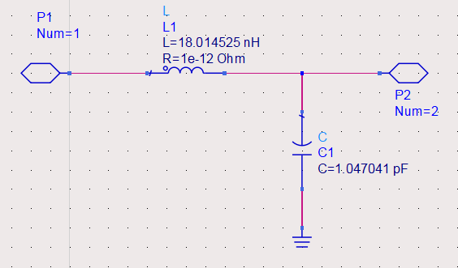
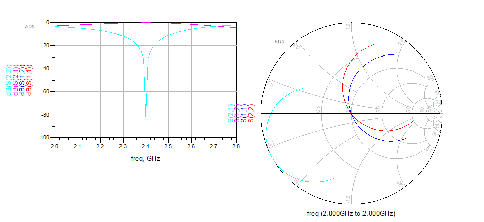
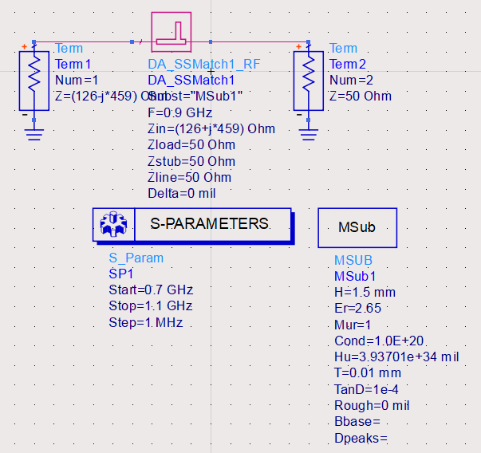

# 实验题目：ADS软件基础与应用

# 实验内容
## 传输线仿真实验
### 实验目的
- 了解ADS软件的基本应用
- 根据无耗均匀传输线理论，借助ADS软件对传输线终端负载分别为匹配负载、短路、开路、纯电抗、复阻抗五种情况进行电路设计与仿真。

### 匹配负载
#### 电路连接

#### 仿真结果

由上图可以看出匹配负载情况下$S11=S22=0$，代表无反射状态，即能量被全部吸收。

$S12=S21=exp(-j\theta)$，表示传输线将所有能量均传输到负载端，与理想情况下匹配负载的结论一致。

### 短路
#### 电路连接

#### 仿真结果

在短路情况下反射系数模值为1，而反射波幅度为0，代表能量全被反射回来。同时在1GHz下，短路线处反射系数相位为180°，与理论分析一致。

### 开路
#### 电路连接

#### 仿真结果

开路情况与短路情况在反射波幅度与Smith圆图上轨迹重合，但开路情况下反射系数相位为0，这点与理论分析一致。

### 纯电抗
#### 电路

#### 仿真结果

纯电抗情况下反射波幅度与Smith圆图与开/短路情况无区别，但初始相位应满足$\theta=\arctan{20/50}*2=43.6°$，与仿真结果一致，说明仿真正确。

### 复阻抗
#### 电路

#### 仿真结果

对于ZL=50+100j Ohm的负载来说，理论上反射系数$\Gamma=\frac{ZL-Z0}{ZL+Z0}=\frac{\exp{j*45°}}{\sqrt{2}}=S22$，与仿真结果一致，说明仿真正确。

## 匹配网络的设计与仿真

### 实验目的
- 掌握阻抗匹配、共轭匹配的原理
- 掌握集总元件L型阻抗匹配网络的匹配机理
- 掌握并(串)联单支节调配器，$\lambda/4$阻抗变换器匹配机理
- 掌握Smith圆图的构成及在阻抗匹配中的应用

### 设计L型阻抗匹配网络，使Zs=(40-j*100) Ohm信号源与ZL=(20+j*20) Ohm的负载匹配，频率为100MHz

### 实验步骤
1. 添加负载与`DA_SmithChartMatching`控件，设置参数与匹配目标一致。
2. 在`tools->Smitch Chart`菜单配置`DA_SmithChartMatching`控件并选择L型匹配网络类型。完成后点击`Build ADS Circuit`生成电路。
3. 使用`S-Parameters`控件对该电路进行仿真。

### 参数配置

### 电路连接

### 内部电路

### 仿真结果

右图中S11与S22重合，S12与S21重合，体现为在100MHz处匹配成功，此时在加入L型匹配网络后的电路中没有反射，即能量被完全传输，达到最大传输功率。但随频率的偏移，匹配效果变差，Smith圆图中也体现了这一变化。

## 微带单支节短截线匹配网络设计与仿真
### 实验目的
- 了解微带线的基本结构
- 了解微带单支节短截线匹配网络设计与仿真步骤

### 设计微带单支节短截线匹配电路，使输出阻抗Zs=(25-j*25) Ohm的源与ZL=(100-j*25)Ohm的负载匹配，中心频率为2GHz

### 实验步骤
1. 添加负载、微带线、S参数控件与单支节短截线。
2. 设置微带线板材参数，单支节匹配电路参数，其中输入阻抗为MAX2600的输出阻抗的共轭。
3. 调用`DesignGuide->Passive Circuit`生成电路并仿真。

### 电路连接

### 内部电路

### 仿真结果

可见电路在2GHz附近实现了匹配，此时负载处反射波相比入射波来说很小，说明匹配成功。左图中S11与S22重合，S12与S21重合。实际匹配频率相比2GHz有所偏移，实际应用中仍需要其他调整。
<!-- 
# 实验目的
## ADS软件基础与应用
- 了解ADS软件的基本使用
- 掌握使用ADS进行设计、仿真与优化
- 使用ADS进行匹配网络设计

## 匹配网络的设计与仿真
- 了解ADS软件的主要功能特点
- 掌握阻抗匹配、共轭匹配的原理
- 掌握集总元件L型阻抗匹配网络的匹配机理
- 掌握并(串)联单支节调配器件、$\lambda/4$阻抗变换器匹配机理
- 掌握Smith原图的构成及再阻抗匹配中的应用
- 了解微带线的基本结构

# 实验内容
## 设计L型阻抗匹配网络，使Zs=(46-i\*124)Ohm信号源与ZL=(20+i\*100)Ohm的负载匹配，频率为2400MHz
### 实验步骤
1. 添加负载与`DA_SmithChartMatching`控件，设置参数与匹配目标一致。
2. 在`tools->Smitch Chart`菜单配置`DA_SmithChartMatching`控件并选择L型匹配网络类型。完成后点击`Build ADS Circuit`生成电路。
3. 使用`S-Parameters`控件对该电路进行仿真。

### 电路连接

### L型匹配网络参数

### 匹配网络1
#### 生成电路

#### 仿真结果

左图中S11与S22重合，S12与S21重合，体现为在2.4GHz处匹配成功，此时在加入L型匹配网络后的电路中没有反射，即能量被完全传输，达到最大传输功率。但随频率的偏移，匹配效果变差，Smith圆图中也体现了这一变化。

### 匹配网络2
#### 生成电路

#### 仿真结果

效果与匹配网络1有所相似，但由于电路元件位置的不同在Smith原图上以及偏离匹配频率的S参数幅值上可以看出其区别，但两者均在中心频率点上达到理想的匹配。

## 微带单支节短截线匹配电路，使MAX2660的输出阻抗Zs=(126-i\*459)Ohm与ZL=50OHm的负载匹配，频率为900MHz。
### 实验步骤
1. 添加负载、微带线、S参数控件与单支节短截线。
2. 设置微带线板材参数，单支节匹配电路参数，其中输入阻抗为MAX2600的输出阻抗的共轭。
3. 调用`DesignGuide->Passive Circuit`生成电路并仿真。

### 电路连接

### 单支节短截线参数

### 仿真结果

可见电路在900MHz附近实现了匹配，此时负载处反射波相比入射波来说很小，说明匹配成功。左图中S11与S22重合，S12与S21重合。实际匹配频率相比900MHz有所偏移，实际应用中仍需要其他调整。 -->

# 思考题
1. 常用的微波/射频EDA仿真软件有哪些  
使用矩量法(MOM)的微波/射频EDA仿真软件有ADS、Ansoft Designer、Microwave Office、Ansoft Esemble、Super NEC和FEKO；使用时域有限差分法(FDTD)的微波/射频EDA仿真软件有EMPIRE和XFDTD；使用有限积分法(FIT)的微波/射频EDA仿真软件有CST Microwave Studio和CST Mafia等。

2. 使用ADS软件进行匹配电路设计和仿真的主要步骤有哪些  
选择元器件，配置其参数->选择合适的匹配结构，设定匹配目标并计算匹配结果->添加对应控件仿真测试匹配是否成功。

3. 给出两种典型微波匹配网络，并简述其工作原理  
L型匹配网络：通过在负载处并联一电感(容)并串联一电容(感)的方式调整负载阻抗使得其等效阻抗匹配。  
单支节匹配：先经过一段传输线使阻抗的实部变为1，再通过并联一段传输线使得其虚部消失来达到匹配的目的。其中两端传输线长度可调。

4. 写出实验体会与建议  
ADS软件可以通过手工绘制电路的方法对实际电路进行建模，并可以调整很多参数来观察其对整个电路的影响，便于进行分析。但是在平时的课程中我们还是较少用到这种工具，如果可以的话希望能不仅在实验课中尝试这种软件，在理论课上也可以讲一讲这种软件在实际生产中应用情况。